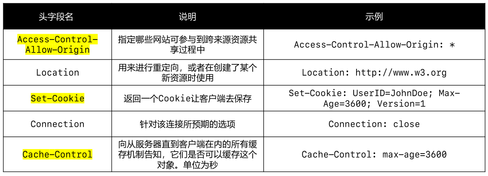

# 基本概念

- HTTP 是一个用在计算机世界里的协议，它确立了一种计算机之间交流通信的规范，以及相关的各种控制和错误处理方式
- HTTP 专门用来在两点之间传输数据，不能用于广播、寻址或路由
- HTTP 传输的是文字、图片、音频、视频等超文本数据


## 版本历史

- HTTP协议始于三十年前蒂姆·伯纳斯-李的一篇论文
- HTTP/0.9是个简单的文本协议，只能获取文本资源
- HTTP/1.0确立了大部分现在使用的技术，但它不是正式标准
- HTTP/1.1是目前互联网上使用最广泛的协议，功能也非常完善
- HTTP/2 基于Google的 SPDY 协议，注重性能改善，但还未普及
- HTTP/3 基于Google的 QUIC 协议，是将来的发展方向

## 相关概念

### CDN

CDN，全称是 “Content Delivery Network”，翻译过来就是“内容分发网络”。它应用了 HTTP 协议里的缓存和代理技术，代替源站响应客户端的请求。

它可以缓存源站的数据，让浏览器的请求不用“千里迢迢”地到达源站服务器，直接在“半路”就可以获取响应。如果CDN的调度算法很优秀，更可以找到离用户最近的节点，大幅度缩短响应时间。

CDN也是现在互联网中的一项重要基础设施，除了基本的网络加速外，还提供负载均衡、安全防护、边缘计算、跨运营商网络等功能，能够成倍地“放大”源站服务器的服务能力。

### HTML

HTML 是HTTP协议传输的主要内容之一，它描述了超文本页面，用各种“标签”定义文字、图片等资源和排版布局，最终由浏览器“渲染”出可视化页面。

HTML目前有两个主要的标准，HTML4 和 HTML5。

### **Web**  Service

Web Service是一种由W3C定义的应用服务开发规范，使用client-server主从架构，通常使用 WSDL 定义服务接口，使用 HTTP 协议传输 XML 或 SOAP 消息，也就是说，它是一个基于Web（HTTP）的服务架构技术，既可以运行在内网，也可以在适当保护后运行在外网。

### WAF

WAF 意思是“网络应用防火墙”。与硬件“防火墙”类似，它是应用层面的“防火墙”，专门检测 HTTP 流量，是防护 Web 应用的安全技术。

WAF 通常位于 Web 服务器之前，可以阻止如 SQL 注入、跨站脚本等攻击，目前应用较多的一个开源项目是 ModSecurity，它能够完全集成进 Apache 或 Nginx。

## 相关协议

### URI/URL

URI（Uniform Resource Identifier），中文名称是 统一资源标识符，使用它就能够唯一地标记互联网上资源。

URI 另一个更常用的表现形式是URL（Uniform Resource Locator）， 统一资源定位符，也就是我们俗称的“网址”，它实际上是 URI 的一个子集，不过因为这两者几乎是相同的，差异不大，所以通常不会做严格的区分。

```
http://nginx.org/en/download.html
```

URI主要有三个基本的部分构成：

- 协议名：即访问该资源应当使用的协议，在这里是“http”
- 主机名：即互联网上主机的标记，可以是域名或 IP 地址，在这里是“nginx.org”
- 路径：即资源在主机上的位置，使用“/”分隔多级目录，在这里是“/en/download.html”。

URL 中一旦出现了一些特殊字符（比如中文、空格），需要进行编码，在浏览器地址栏输入URL时，是采用 UTF-8 进行编码。

### HTTPS

HTTPS 它的全称是“HTTP over SSL/TLS”，也就是运行在 SSL/TLS 协议上的 HTTP。

SSL/TLS 是一个负责加密通信的安全协议，建立在TCP/IP之上，所以也是个可靠的传输协议，可以被用作HTTP的下层。SSL 的全称是“Secure Socket Layer”，由网景公司发明，当发展到3.0时被标准化，改名为 TLS，即“Transport Layer Security”，但由于历史的原因还是有很多人称之为 SSL/TLS，或者直接简称为 SSL。

SSL 使用了许多密码学最先进的研究成果，综合了对称加密、非对称加密、摘要算法、数字签名、数字证书等技术，能够在不安全的环境中为通信的双方创建出一个秘密的、安全的传输通道，为HTTP套上一副坚固的盔甲。

### 代理

代理（Proxy）是 HTTP 协议中请求方和应答方中间的一个环节，作为“中转站”，既可以转发客户端的请求，也可以转发服务器的应答。

代理有很多的种类，常见的有：

- 匿名代理：完全“隐匿”了被代理的机器，外界看到的只是代理服务器
- 透明代理：顾名思义，它在传输过程中是“透明开放”的，外界既知道代理，也知道客户端
- 正向代理：靠近客户端，代表客户端向服务器发送请求
- 反向代理：靠近服务器端，代表服务器响应客户端的请求

CDN 实际上就是一种代理，它代替源站服务器响应客户端的请求，通常扮演着透明代理和反向代理的角色。

由于代理在传输过程中插入了一个“中间层”，所以可以在这个环节做很多有意思的事情，比如：

- 负载均衡：把访问请求均匀分散到多台机器，实现访问集群化
- 内容缓存：暂存上下行的数据，减轻后端的压力
- 安全防护：隐匿IP,使用WAF等工具抵御网络攻击，保护被代理的机器
- 数据处理：提供压缩、加密等额外的功能

# TCP/IP

## TCP/IP 网络分层模型


第一层叫链接层（link layer），负责在以太网、WiFi 这样的底层网络上发送原始数据包，工作在网卡这个层次，使用 MAC 地址来标记网络上的设备，所以有时候也叫 MAC 层。

第二层叫“网际层”或者“网络互连层”（internet layer），IP 协议就处在这一层。因为 IP 协议定义了“IP地址”的概念，所以就可以在“链接层”的基础上，用IP地址取代MAC 地址，把许许多多的局域网、广域网连接成一个虚拟的巨大网络，在这个网络里找设备时只要把 IP 地址再“翻译”成 MAC 地址就可以了。

第三层叫“传输层”（transport layer），这个层次协议的职责是保证数据在 IP 地址标记的两点之间“可靠”地传输，是TCP协议工作的层次，另外还有它的一个“小伙伴”UDP。

TCP是一个有状态的协议，需要先与对方建立连接然后才能发送数据，而且保证数据不丢失不重复。而UDP则比较简单，它无状态，不用事先建立连接就可以任意发送数据，但不保证数据一定会发到对方。两个协议的另一个重要区别在于数据的形式。TCP的数据是连续的“字节流”，有先后顺序，而UDP则是分散的小数据包，是顺序发，乱序收。

第四层叫“应用层”（application layer），有各种面向具体应用的协议。例如，Telnet、SSH、FTP、SMTP等等，当然还有HTTP。

MAC 层的传输单位是帧（frame），IP 层的传输单位是包（packet），TCP 层的传输单位是段（segment），HTTP的传输单位则是消息或报文（message）。但这些名词并没有什么本质的区分，可以统称为数据包。

##　OSI网络分层模型


OSI，全称是“开放式系统互联通信参考模型”（Open System Interconnection Reference Model）。

- 第一层：物理层，网络的物理形式，例如，电缆、光纤、网卡、集线器等等
- 第二层：数据链路层，它基本相当于TCP/IP的链接层
- 第三层：网络层，相当于TCP/IP里的网际层
- 第四层：传输层，相当于TCP/IP里的传输层
- 第五层：会话层，维护网络中的连接状态，即保持会话和同步
- 第六层：表示层，把数据转换为合适、可理解的语法和语义
- 第七层：应用层，面向具体的应用传输数据

## 两种模型对比


- 第一层：物理层，TCP/IP里无对应
- 第二层：数据链路层，对应TCP/IP的链接层
- 第三层：网络层，对应TCP/IP的网际层
- 第四层：传输层，对应TCP/IP的传输层
- 第五、六、七层：统一对应到TCP/IP的应用层

所谓的“四层负载均衡”就是指工作在传输层上，基于TCP/IP协议的特性，例如IP地址、端口号等实现对后端服务器的负载均衡。

所谓的“七层负载均衡”就是指工作在应用层上，看到的是HTTP协议，解析HTTP报文里的URI、主机名、资源类型等数据，再用适当的策略转发给后端服务器。

## TCP/IP协议栈的工作方式


HTTP协议的传输过程就是这样通过协议栈逐层向下，每一层都添加本层的专有数据，层层打包，然后通过下层发送出去。

接收数据是则是相反的操作，从下往上穿过协议栈，逐层拆包，每层去掉本层的专有头，上层就会拿到自己的数据。

# 域名

域名是一个有层次的结构，是一串用“.”分隔的多个单词，最右边的被称为“顶级域名”，然后是“二级域名”，层级关系向左依次降低。

域名本质上还是个名字空间系统，使用多级域名就可以划分出不同的国家、地区、组织、公司、部门，每个域名都是独一无二的，可以作为一种身份的标识。

## 域名解析

就像IP地址必须转换成MAC地址才能访问主机一样，域名也必须要转换成IP地址，这个过程就是“域名解析”。

DNS的核心系统是一个三层的树状、分布式服务，基本对应域名的结构：

- 根域名服务器（Root DNS Server）：管理顶级域名服务器，返回 `com`，`net`，`cn` 等顶级域名服务器的 IP 地址
- 顶级域名服务器（Top-level DNS Server）：管理各自域名下的权威域名服务器，比如com顶级域名服务器可以返回 `apple.com` 域名服务器的 IP 地址
- 权威域名服务器（Authoritative DNS Server）：管理自己域名下主机的 IP 地址，比如 `apple.com` 权威域名服务器可以返回 `www.apple.com` 的 IP 地址


例如，你要访问`www.apple.com`，就要进行下面的三次查询：

- 访问根域名服务器，它会告诉你 `com` 顶级域名服务器的地址
- 访问 `com` 顶级域名服务器，它再告诉你 `apple.com` 域名服务器的地址
- 最后访问 `apple.com` 域名服务器，就得到了 `www.apple.com` 的地址

虽然核心的DNS系统遍布全球，服务能力很强也很稳定，但如果全世界的网民都往这个系统里挤，即使不挤瘫痪了，访问速度也会很慢。所以在核心DNS系统之外，还有两种手段用来减轻域名解析的压力，并且能够更快地获取结果，基本思路就是“缓存”。

- 许多大公司、网络运行商都会建立自己的DNS服务器，作为用户DNS查询的代理，代替用户访问核心DNS系统。这些“野生”服务器被称为“非权威域名服务器”，可以缓存之前的查询结果，如果已经有了记录，就无需再向根服务器发起查询，直接返回对应的IP地址
- 操作系统里也会对DNS解析结果做缓存，如果你之前访问过 `www.apple.com`，那么下一次在浏览器里再输入这个网址的时候就不会再跑到DNS那里去问了，直接在操作系统里就可以拿到IP地址
- 操作系统里还有一个特殊的“主机映射”文件，通常是一个可编辑的文本，在Linux里是 `/etc/hosts`，在 Windows 里是 `C:\WINDOWS\system32\drivers\etc\hosts`，如果操作系统在缓存里找不到DNS记录，就会找这个文件

## 域名的“新玩法”

### 重定向

因为域名代替了IP地址，所以可以让对外服务的域名不变，而主机的IP地址任意变动。当主机有情况需要下线、迁移时，可以更改DNS记录，让域名指向其他的机器。

### 内部使用

因为域名是一个名字空间，所以可以使用bind9等开源软件搭建一个在内部使用的DNS，作为名字服务器。这样我们开发的各种内部服务就都用域名来标记，比如数据库服务都用域名“mysql.inner.app”，商品服务都用“goods.inner.app”，发起网络通信时也就不必再使用写死的IP地址了，可以直接用域名。

### 负载均衡

有两种方式，两种方式可以混用：

- 第一种方式，因为域名解析可以返回多个IP地址，所以一个域名可以对应多台主机，客户端收到多个IP地址后，就可以自己使用轮询算法依次向服务器发起请求，实现负载均衡
- 第二种方式，域名解析可以配置内部的策略，返回离客户端最近的主机，或者返回当前服务质量最好的主机，这样在DNS端把请求分发到不同的服务器，实现负载均衡


## 报文格式


## 请求方法

- GET：常用于读取的操作，请求参数直接拼接在URL的后面（浏览器对URL是有长度限制的）
- POST：常用于添加、修改、删除的操作，请求参数可以放到请求体中（没有大小限制）
- HEAD：请求得到与 GET 请求相同的响应，但没有响应体，使用场景：在下载一个大文件前，先获取其大小(HEAD)，再决定是否要下载(GET)。以此可以节约带宽资源
- OPTIONS：用于获取目的资源所支持的通信选项
- PUT：用于对已存在的资源进行整体覆盖
- PATCH：用于对资源进行部分修改（资源不存在，会创建新的资源）
- DELETE：用于删除指定的资源
- TRACE：请求服务器回显其收到的请求信息，主要用于 HTTP 请求的测试或诊断
- CONNECT：可以开启一个客户端与所请求资源之间的双向沟通的通道，它可以用来创建隧道（tunnel）

## 头部字段（Header Field）
头部字段可以分为 4 种类型：

- 请求头字段（Request Header Fields），有关要获取的资源或客户端本身信息的消息头
- 响应头字段（Response Header Fields），有关响应的补充信息，比如服务器本身（名称和版本等）的消息头
- 实体头字段（Entity Header Fields），有关实体主体的更多信息，比如主体长度（Content-Length）或其 MIME 类型
- 通用头字段（General Header Fields），同时适用于请求和响应消息，但与消息主体无关的消息头

### 请求头字段


q 值越大，表示优先级越高，如果不指定q值，默认是1.0（1.0是最大值）


### 响应头字段




## 状态码

状态码可以分为 5 类

- 信息响应：100~199
- 成功响应：200~299
- 重定向：300~399
- 客户端错误：400~499
- 服务器错误 ：500~599

### 常见状态码

- 100 Continue
  - 请求的初始部分已经被服务器收到，并且没有被服务器拒绝。客户端应该继续发送剩余的请求，如果请求已经完成，就忽略这个响应
  - 允许客户端发送带请求体的请求前，判断服务器是否愿意接收请求（服务器通过请求头判断）
  - 在某些情况下，如果服务器在不看请求体就拒绝请求时，客户端就发送请求体是不恰当的或低效的
- 200 OK：请求成功
- 302 Found：请求的资源被暂时的移动到了由 Location 头部指定的 URL 上
- 304 Not Modified：说明无需再次传输请求的内容，也就是说可以使用缓存的内容
- 400 Bad Request：由于语法无效，服务器无法理解该请求
- 401 Unauthorized：由于缺乏目标资源要求的身份验证凭证
- 403 Forbidden：服务器端有能力处理该请求，但是拒绝授权访问
- 404 Not Found：服务器端无法找到所请求的资源
- 405 Method Not Allowed：服务器禁止了使用当前HTTP方法的请求
- 406 Not Acceptable：服务器端无法提供与Accept-Charset以及Accept-Language指定的值相匹配的响应
- 408 Request Timeout：服务器想要将没有在使用的连接关闭，一些服务器会在空闲连接上发送此信息，即便是在客户端没有发送任何请求的情况下
- 500 Internal Server Error：所请求的服务器遇到意外的情况并阻止其执行请求
- 501 Not Implemented：请求的方法不被服务器支持，因此无法被处理，服务器必须支持的方法（即不会返回这个状态码的方法）只有 GET 和 HEAD
- 502 Bad Gateway：作为网关或代理角色的服务器，从上游服务器（如tomcat）中接收到的响应是无效的
- 503 Service Unavailable：服务器尚未处于可以接受请求的状态，通常造成这种情况的原因是由于服务器停机维护或者已超载

## form 提交

### 常用属性

- action：请求的URI
- method：请求方法（GET、POST）
- enctype：POST请求时，请求体的编码方式
- application/x-www-form-urlencoded（默认值），用 `&` 分隔参数，用 `=` 分隔键和值，字符用 URL 编码方式进行编码
- multipart/form-data，文件上传时必须使用这种编码方式

### multipart/form-data


# 代理服务器


特点：

- 本身不生产内容
- 处于中间位置转发上下游的请求和响应
  - 面向下游的客户端：它是服务器
  - 面向上游的服务器：它是客户端

### 正向代理、反向代理

- 正向代理：代理的对象是客户端
- 反向代理：代理的对象是服务器


**正向代理的作用**

- 隐藏客户端身份
- 绕过防火墙（突破访问限制）
- Internet 访问控制
- 数据过滤


**反向代理的作用**

- 隐藏服务器身份
- 安全防护
- 负载均衡


## 代理服务器相关头部字段


# CDN (内容分发网络)

CDN（Content Delivery Network或Content Distribution Network），内容分发网络，利用最靠近每位用户的服务器，更快更可靠地将音乐、图片、视频等资源文件（一般是静态资源）传递给用户。


# 缓存


通常会缓存的情况是：GET 请求 + 静态资源(比如 HTML，CSS，JS，图片等)，可以使用 `Ctrl+F5` 强制刷新缓存。

缓存使用流程：


缓存响应头：


Last-Modified 和 ETag：


