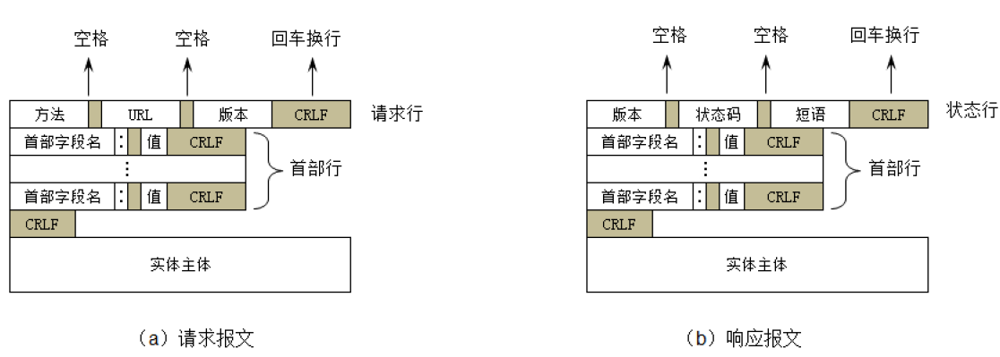

# URI 和 URL

URI 和 URL的关系：URI包括了URL。
`html/login.html`，这是个URI，它不能在网唯一标识。
`http://localhost:8080/hello/html/login.html` 这个 URI 可以在全网唯一标识，称为 URL。

URL 中一旦出现了一些特殊字符（比如中文、空格），需要进行编码，在浏览器地址栏输入URL时，是采用 UTF-8 进行编码。

# HTTP

HTTP（Hyper Text Transfer Protocol），超文本传输协议。

## HTTP 版本
- 1991年，HTTP/0.9
  - 只支持 GET 请求方法获取文本数据（比如HTML文档），且不支持请求头、响应头等，无法向服务器传递太多信息
- 1996年，HTTP/1.0
- 支持 POST、HEAD 等请求方法，支持请求头、响应头等，支持更多种数据类型（不再局限于文本数据），浏览器的每次请求都需要与服务器建立一个TCP连接，请求处理完成后立即断开TCP连接
- 1997年，HTTP/1.1（最经典、使用最广泛的版本）
  - 支持PUT、DELETE等请求方法，采用 持久连接（Connection: keep-alive），多个请求可以共用同一个TCP连接
- 2015年，HTTP/2.0
- 2018年，HTTP/3.0

##　HTTP 标准

由万维网协会（W3C）、互联网工程任务组（IETF）协调制定，最终发布了一系列的RFC，RFC（Request For Comments，可以译为：请求意见稿）。

- HTTP/1.1 最早是在 1997 年的 RFC 2068 中记录的，该规范在 1999 年的 RFC 2616 中已作废
- 2014 年又由 RFC 7230 系列的RFC取代
- HTTP/2 标准于 2015 年 5 月以 RFC 7540 正式发表，取代 HTTP/1.1 成为 HTTP 的实现标准

## 报文格式

## 请求方法

- GET：常用于读取的操作，请求参数直接拼接在URL的后面（浏览器对URL是有长度限制的）
- POST：常用于添加、修改、删除的操作，请求参数可以放到请求体中（没有大小限制）
- HEAD：请求得到与 GET 请求相同的响应，但没有响应体，使用场景：在下载一个大文件前，先获取其大小(HEAD)，再决定是否要下载(GET)。以此可以节约带宽资源
- OPTIONS：用于获取目的资源所支持的通信选项
- PUT：用于对已存在的资源进行整体覆盖
- PATCH：用于对资源进行部分修改（资源不存在，会创建新的资源）
- DELETE：用于删除指定的资源
- TRACE：请求服务器回显其收到的请求信息，主要用于 HTTP 请求的测试或诊断
- CONNECT：可以开启一个客户端与所请求资源之间的双向沟通的通道，它可以用来创建隧道（tunnel）

## 头部字段（Header Field）
头部字段可以分为 4 种类型：

- 请求头字段（Request Header Fields），有关要获取的资源或客户端本身信息的消息头
- 响应头字段（Response Header Fields），有关响应的补充信息，比如服务器本身（名称和版本等）的消息头
- 实体头字段（Entity Header Fields），有关实体主体的更多信息，比如主体长度（Content-Length）或其 MIME 类型
- 通用头字段（General Header Fields），同时适用于请求和响应消息，但与消息主体无关的消息头

### 请求头字段

q 值越大，表示优先级越高，如果不指定q值，默认是1.0（1.0是最大值）

### 响应头字段

## 状态码

状态码可以分为 5 类

- 信息响应：100~199
- 成功响应：200~299
- 重定向：300~399
- 客户端错误：400~499
- 服务器错误 ：500~599

### 常见状态码

- 100 Continue
  - 请求的初始部分已经被服务器收到，并且没有被服务器拒绝。客户端应该继续发送剩余的请求，如果请求已经完成，就忽略这个响应
  - 允许客户端发送带请求体的请求前，判断服务器是否愿意接收请求（服务器通过请求头判断）
  - 在某些情况下，如果服务器在不看请求体就拒绝请求时，客户端就发送请求体是不恰当的或低效的
- 200 OK：请求成功
- 302 Found：请求的资源被暂时的移动到了由 Location 头部指定的 URL 上
- 304 Not Modified：说明无需再次传输请求的内容，也就是说可以使用缓存的内容
- 400 Bad Request：由于语法无效，服务器无法理解该请求
- 401 Unauthorized：由于缺乏目标资源要求的身份验证凭证
- 403 Forbidden：服务器端有能力处理该请求，但是拒绝授权访问
- 404 Not Found：服务器端无法找到所请求的资源
- 405 Method Not Allowed：服务器禁止了使用当前HTTP方法的请求
- 406 Not Acceptable：服务器端无法提供与Accept-Charset以及Accept-Language指定的值相匹配的响应
- 408 Request Timeout：服务器想要将没有在使用的连接关闭，一些服务器会在空闲连接上发送此信息，即便是在客户端没有发送任何请求的情况下
- 500 Internal Server Error：所请求的服务器遇到意外的情况并阻止其执行请求
- 501 Not Implemented：请求的方法不被服务器支持，因此无法被处理，服务器必须支持的方法（即不会返回这个状态码的方法）只有 GET 和 HEAD
- 502 Bad Gateway：作为网关或代理角色的服务器，从上游服务器（如tomcat）中接收到的响应是无效的
- 503 Service Unavailable：服务器尚未处于可以接受请求的状态，通常造成这种情况的原因是由于服务器停机维护或者已超载

## form 提交

### 常用属性

- action：请求的URI
- method：请求方法（GET、POST）
- enctype：POST请求时，请求体的编码方式
- application/x-www-form-urlencoded（默认值），用 `&` 分隔参数，用 `=` 分隔键和值，字符用 URL 编码方式进行编码
- multipart/form-data，文件上传时必须使用这种编码方式

### multipart/form-data

# 代理服务器

特点：

- 本身不生产内容
- 处于中间位置转发上下游的请求和响应
  - 面向下游的客户端：它是服务器
  - 面向上游的服务器：它是客户端

### 正向代理、反向代理

- 正向代理：代理的对象是客户端
- 反向代理：代理的对象是服务器

**正向代理的作用**

- 隐藏客户端身份
- 绕过防火墙（突破访问限制）
- Internet 访问控制
- 数据过滤

**反向代理的作用**

- 隐藏服务器身份
- 安全防护
- 负载均衡

## 代理服务器相关头部字段

# CDN (内容分发网络)

CDN（Content Delivery Network或Content Distribution Network），内容分发网络，利用最靠近每位用户的服务器，更快更可靠地将音乐、图片、视频等资源文件（一般是静态资源）传递给用户。

# 缓存

通常会缓存的情况是：GET 请求 + 静态资源(比如 HTML，CSS，JS，图片等)，可以使用 `Ctrl+F5` 强制刷新缓存。

缓存使用流程：

缓存响应头：

Last-Modified 和 ETag：

