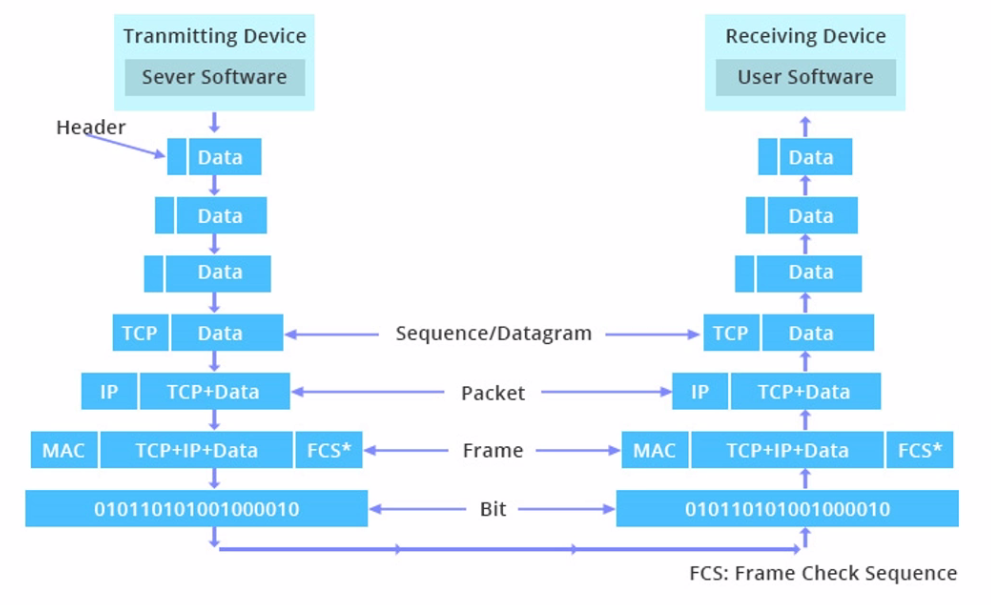
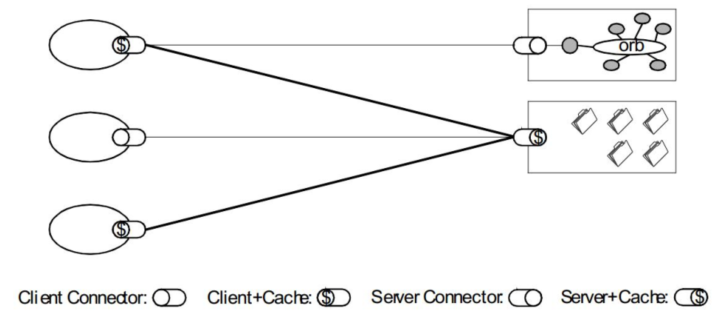
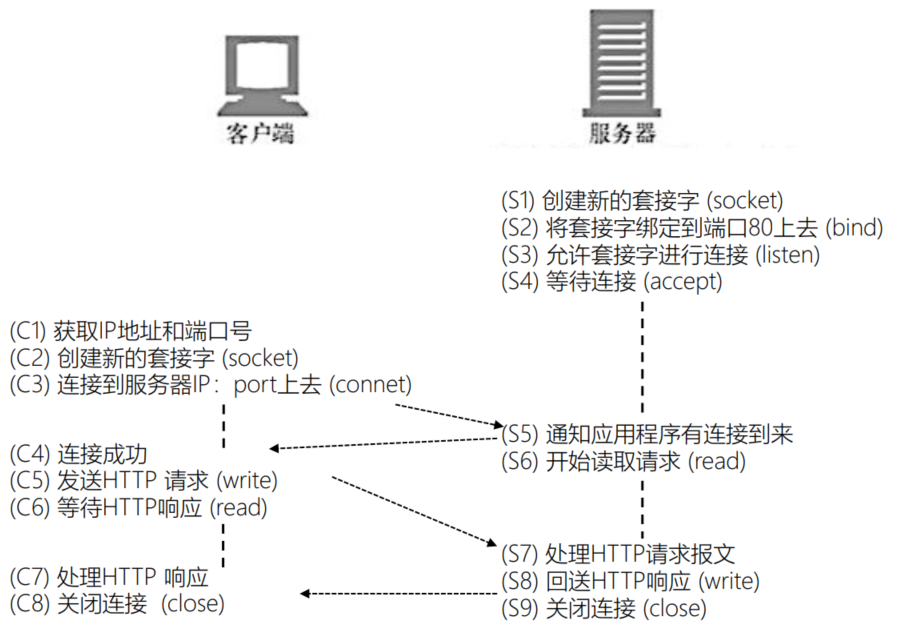

浏览器发起 Http 请求的典型场景：


Http(Hypertext Transfer Protocol) 协议是一种无状态的，应用层的，以请求-应答方式运行的协议，它使用可扩展的语义和自描述消息格式，与基于网络的超文本信息系统灵活的互动。

# Http 消息格式

## ABNF(扩展巴科斯-瑙尔范式)


## http 消息格式


# 网络分层

## OSI 概念模型


## TCP/IP 模型


## 封装与解封装



# Web 架构的关键属性

- 性能 Performance，影响高可用的关键因素  
  - 网络性能
    - 吞吐量 Throughput，小于等于带宽 bandwidth
    - 开销 Overhead，首次开销，每次开销
  - 用户感知到的性能
    - 延迟 Latency，发起请求到接收到响应的时间
    - 完成时间 Completion，完成一个应用动作花费的时间
  - 网络效率
    - 重用缓存，较少交互次数，数据传输距离更近，COD
- 可伸缩性 Scability，支持部署可以互相交互的大量组件  
- 简单性 Simplicity，易理解、易实现、易验证  
- 可见性 Visible，对两个组件间的交互进行监视或者仲裁的能力。如缓存、分层设计等  
- 可移植性 Portability，在不同的环境下运行的能力  
- 可靠性 Reliability，出现部分故障时，对整体影响的程度  
- 可修改性 Modifiability，对系统作出修改的难易程度  
  - 可进化性 Evolvability，一个组件独立升级不会影响其他组件
  - 可扩展性 Extensibility，向系统添加功能，不会影响到系统的其他部分
  - 可定制性 Customizability，临时性，定制性的更改某一要素，不会对其他常规用户产生影响
  - 可配置性 Configuratility，应用部署后可以通过修改配置提供新的功能
  - 可重用性 Reusability，组件可以不做修改在其他应用中使用

## REST 架构下的 Web


# 五种架构风格

- 数据流风格 Data-flow Styles，优点：简单性、可进化性、可扩展性、可配置性、可重用性
- 复制风格 Replication Styles，优点：用户可察觉的性能、可伸缩性，网络效率、可靠性也可以提到提升
- 分层风格 Hierarchical Styles，优点：简单性、可进化性、可伸缩性
- 移动代码风格 Mobile Code Styles，优点：可移植性、可扩展性、网络效率
- 点对点风格 Peer-to-Peer Styles，优点：可进化性、可重用性、可扩展性、可配置性  

## 数据流风格  

管道与过滤器 Pipe And Filter，PF ，每个 Filter 都有输入端和输出端，只能从输入端读取数据，处理后再从输出端产生数据：


统一接口的管道与过滤器 Uniform Pipe And Filter，UPF： 在 PF 上增加了统一接口的约束，所有 Filter 过滤器必须具备同样的接口。


## 复制风格

复制仓库 Replicated Repository，RR， 多个进程提供相同的服务，通过反向代理对外提供集中服务。

缓存 $  ：RR的变体，通过复制请求的结果，为后续请求复用。




## 分层风格  

**户端服务器 Client-Server，CS**

- 由 Client 触发请求，Server 监听到请求后产生响应，Client 一直等待收到响应后，会话结束
- 分离关注点隐藏细节，良好的简单性、可伸缩性、可进化性  

**分层系统 Layered System ，LS**

- 每一层为其之上的层服务，并使用在其之下的层所提供的服务，例如 TCP/IP  

**分层客户端服务器 Layered Client-Server ， LCS**

- LS+CS，例如正向代理和反向代理，从空间上分为外部层与内部层  

**无状态、客户端服务器 Client-Stateless-Server CSS**

- 基于 CS，服务器上不允许有session state会话状态
- 提升了可见性、可伸缩性、可靠性，但重复数据导致降低网络性能

**缓存、无状态、客户端服务器 Client-Cache-Stateless-Server C$SS**

- 提升性能
- 分层、缓存、无状态、客户端服务器 Layered-Client-Cache-Stateless-Server,LC$SS  

LC$SS 架构：


**远程会话 Remote Session, RS**

- CS 变体，服务器保存 Application state 应用状态
- 可伸缩性、可见性差

**远程数据访问 Remote Data Access ， RDA**

- CS 变体， Application state 应用状态同时分布在客户端与服务器
- 巨大的数据集有可能通过迭代而减少
- 简单性、可伸缩性差  


## 移动代码风格
**虚拟机 Virtual Machine， VM**

- 分离指令与实现

**远程求值 Remote Evaluation， REV**

- 基于 CS 的 VM，将代码发送至服务器执行

**按需代码 Code on Demand， COD**

- 服务器在响应中发回处理代码，在客户端执行
-  优秀的可扩展性和可配置性，提升用户可察觉性能和网络效率

**分层、按需代码、缓存、无状态、客户端服务器**

- Layered-Code-on-Demand-Client-Cache-Stateless-Server， LCODC$SS
- LC$SS+COD

**移动代理 Mobile Agent， MA**

- 相当于 REV+COD

统一接口的 LC$SS+COD：


## 点对点风格  

**Event-based Integration ，EBI：**

- 基于事件集成系统，如由类似 Kafka 这样的消息系统 + 分发订阅来消除耦合
- 优秀的可重用性、可扩展性、可进化性
- 缺乏可理解性
- 由于消息广播等因素造成的消息风暴，可伸缩性差

**Chiron-2,C2 参**

- 相当于 EBI+LCS，控制了消息的方向

**Distributed Objects ，DO**

- 组件结对交互
- Brokered Distributed Objects ，BDO
- 引入名字解析组件来简化 DO，例如 CORBA


## REST 风格演化


# URL 与 URI

**URL**： RFC1738 （1994.12），Uniform Resource Locator，表示资源的位置，期望提供查找资源的方法。

**URN**：RFC2141 （1997.5），Uniform Resource Name，期望为资源提供持久的、位置无关的标识方式，并允许简单地将多个命名空间映射到单个URN命名
空间，例如磁力链接 magnet:?xt=urn:sha1:YNCKHTQC5C。

**URI**：RFC1630 （1994.6）、RFC3986 （2005.1，取代 RFC2396 和RFC2732 ），Uniform Resource Identifier，用以区分资源，是 URL 和 URN
的超集，用以取代 URL 和 URN。

- Resource 资源
  - 可以是图片、文档、今天杭州的温度等，也可以是不能通过互联网访问的实体，例如人、公司、实体书，也可以是抽象的概念，例如亲属关系或者数字符号
  - 一个资源可以有多个 URI
- Identifier 标识符
    - 将当前资源与其他资源区分开的名称
- Uniform 统一
- 允许不同种类的资源在同一上下文中出现
- 对不同种类的资源标识符可以使用同一种语义进行解读
- 引入新标识符时，不会对已有标识符产生影响
- 允许同一资源标识符在不同的、internet 规模下的上下文中出  

## URI 组成


ABNF 定义

```
URI = scheme ":" hier-part [ "?" query ] [ "#" fragment ]

scheme = ALPHA *( ALPHA / DIGIT / "+" / "-" / "." )
query = *( pchar / "/" / "?" )
fragment = *( pchar / "/" / "?" )
```

hier-part：

```
hier-part = "//" authority path-abempty / path-absolute / path-rootless / path-empty

authority = [ userinfo "@" ] host [ ":" port ]
userinfo = *( unreserved / pct-encoded / sub-delims / ":" )
host = IP-literal / IPv4address / reg-name
port = *DIGIT
```

path：

```
path = path-abempty/ path-absolute/ path-noscheme / path-rootless / path-empty

path-abempty = *( “/” segment )
以/开头的路径或者空路径
path-absolute = “/” [ segment-nz *( “/” segment ) ]
以/开头的路径，但不能以//开头
path-noscheme = segment-nz-nc *( “/” segment )
以非:号开头的路径
path-rootless = segment-nz *( “/” segment )
相对path-noscheme，增加允许以:号开头的路径
path-empty = 0<pchar>
空路径
```

相对 URI ：

```
URI-reference = URI/relative-ref

relative-ref = relative-part [ "?" query ] [ "#" fragment ]
relative-part = "//" authority path-abempty / path-absolute / path-noscheme / path-empty
```

## URI 编码

### 为什么要进行 URI 编码?

- 传递数据中，如果存在用作分隔符的保留字符怎么办？
- 对可能产生歧义性的数据编码
  - 不在 ASCII 码范围内的字符
  - ASCII 码中不可显示的字符
  - URI 中规定的保留字符
  - 不安全字符（传输环节中可能会被不正确处理），如空格、引号、尖括号等  

### 保留字符与非保留字符

保留字符：

reserved = gen-delims / sub-delims

```
gen-delims = ":" / "/" / "?" / "#" / "[" / "]" / "@"
sub-delims = "!" / "$" / "&" / "'" / "(" / ")" / "*" / "+" / "," / ";" / "="  
```

非保留字符：

 unreserved = ALPHA / DIGIT / "-" / "." / "_" / "~"

```
ALPHA: %41-%5A and %61-%7A
DIGIT: %30-%39
-: %2D .: %2E _: %5F
~: %7E，某些实现将其认为保留字符  
```

### URI 百分号编码  

- 百分号编码的方式
  - pct-encoded = "%" HEXDIG HEXDIG，US-ASCII：128 个字符（95 个可显示字符，33 个不可显示字符）  
  - 对于 HEXDIG 十六进制中的字母，大小写等价  

- 非 ASCII 码字符（例如中文）：建议先 UTF8 编码，再 US-ASCII 编码
- 对 URI 合法字符，编码与不编码是等价的  

# 请求行

request-line = method SP request-target SP HTTP-version CRLF  


- method 方法：指明操作目的，动词
- request-target = origin-form / absolute-form / authority-form / asterisk-form  
  - origin-form = absolute-path [ "?" query ]
    - 向 origin server 发起的请求，path 为空时必须传递 /
  - absolute-form = absolute-URI
    - 仅用于向正向代理 proxy 发起请求时，详见正向代理与隧道
  - authority-form = authority
    - 仅用于 CONNECT 方法，例如 CONNECT www.example.com:80 HTTP/1.1
  - asterisk-form = "*“
    - 仅用于 OPTIONS 方法

- HTTP-version 版本号发展历史：https://www.w3.org/Protocols/History.html
  - HTTP/0.9：只支持 GET 方法，过时
  - HTTP/ 1.0：RFC1945，1996， 常见使用于代理服务器（例如 Nginx 默认配置）
  - HTTP/ 1.1：RFC2616，1999
  - HTTP/ 2.0：2015.5 正式发布

## 方法

### 常见方法(RFC7231)

- GET：主要的获取信息方法，大量的性能优化都针对该方法，幂等方法
- HEAD：类似 GET 方法，但服务器不发送 BODY，用以获取 HEAD 元数据，幂等方法
- POST：常用于提交 HTML FORM 表单、新增资源等
- PUT：更新资源，带条件时是幂等方法
- DELETE：删除资源，幂等方法
- CONNECT：建立 tunnel 隧道
- OPTIONS：显示服务器对访问资源支持的方法，幂等方法
- TRACE：回显服务器收到的请求，用于定位问题。有安全风险

### 用于文档管理的 WEBDAV 方法(RFC2518)

- PROPFIND：从 Web 资源中检索以 XML 格式存储的属性。它也被重载，以允许一个检索远程系统的集合结构（也叫目录层次结构）
- PROPPATCH：在单个原子性动作中更改和删除资源的多个属性
- MKCOL：创建集合或者目录
- COPY：将资源从一个 URI 复制到另一个 URI
- MOVE：将资源从一个 URI 移动到另一个 URI
- LOCK：锁定一个资源。WebDAV 支持共享锁和互斥锁
- UNLOCK：解除资源的锁定  

# 响应行

status-line = HTTP-version SP status-code SP reason-phrase CRLF

- status-code = 3DIGIT
- reason-phrase = *( HTAB / SP / VCHAR / obs-text )  


## 响应码分类

### 1xx

1xx：请求已接收到，需要进一步处理才能完成，HTTP1.0 不支持。

- 100 Continue：上传大文件前使用，由客户端发起请求中携带 Expect: 100-continue 头部触发
- 101 Switch Protocols：协议升级使用，由客户端发起请求中携带 Upgrade: 头部触发，如升级 websocket 或者 http/2.0
- 102 Processing：WebDAV 请求可能包含许多涉及文件操作的子请求，需要很长时间才能完成请求。该代码表示服务器已经收到并正在处理请求，但无响应可用。这样可以防止客户端超时，并假设请求丢失

### 2xx

2xx：成功处理请求。

- 200 OK: 成功返回响应
- 201 Created: 有新资源在服务器端被成功创建
- 202 Accepted: 服务器接收并开始处理请求，但请求未处理完成。这样一个模糊的概念是有意如此设计，可以覆盖更多的场景。例如异步、需要长时间处理
  的任务
- 203 Non-Authoritative Information：当代理服务器修改了 origin server 的原始响应包体时（例如更换了HTML中的元素值），代理服务器可以通过修改200为203的方式告知客户端这一事实，方便客户端为这一行为作出相应的处理。203响应可以被缓存
- 204 No Content：成功执行了请求且不携带响应包体，并暗示客户端无需更新当前的页面视图
- 205 Reset Content：成功执行了请求且不携带响应包体，同时指明客户端需要更新当前页面视图
- 206 Partial Content：使用 range 协议时返回部分响应内容时的响应码
- 207 Multi-Status：RFC4918 ，在 WEBDAV 协议中以 XML 返回多个资源的状态
- 208 Already Reported：RFC5842 ，为避免相同集合下资源在207响应码下重复上报，使用 208 可以使用父集合的响应码

### 3xx

3xx：重定向使用 Location 指向的资源或者缓存中的资源。在 RFC2068中规定客户端重定向次数不应超过 5 次，以防止死循环。

- 300 Multiple Choices：资源有多种表述，通过 300 返回给客户端后由其自行选择访问哪一种表述。由于缺乏明确的细节，300 很少使用
- 301 Moved Permanently：资源永久性的重定向到另一个 URI 中
- 302 Found：资源临时的重定向到另一个 URI 中
- 303 See Other：重定向到其他资源，常用于 POST/PUT 等方法的响应中
- 304 Not Modified：当客户端拥有可能过期的缓存时，会携带缓存的标识etag、时间等信息询问服务器缓存是否仍可复用，而304是告诉客户端可以
  复用缓存
- 307 Temporary Redirect：类似302，但明确重定向后请求方法必须与原请求方法相同，不得改变
- 308 Permanent Redirect：类似301，但明确重定向后请求方法必须与原请求方法相同，不得改变

### 4xx

4xx：客户端出现错误。

- 400 Bad Request：服务器认为客户端出现了错误，但不能明确判断为以下哪种错误时使用此错误码。例如，HTTP请求格式错误
- 401 Unauthorized：用户认证信息缺失或者不正确，导致服务器无法处理请求
- 407 Proxy Authentication Required：对需要经由代理的请求，认证信息未通过代理服务器的验证
- 403 Forbidden：服务器理解请求的含义，但没有权限执行此请求
- 404 Not Found：服务器没有找到对应的资源
- 410 Gone：服务器没有找到对应的资源，且明确的知道该位置永久性找不到该资源
- 405 Method Not Allowed：服务器不支持请求行中的 method 方法
- 406 Not Acceptable：对客户端指定的资源表述不存在（例如对语言或者编码有要求），服务器返回表述列表供客户端选择。
- 408 Request Timeout：服务器接收请求超时
- 409 Conflict：资源冲突，例如上传文件时目标位置已经存在版本更新的资源
- 411 Length Required：如果请求含有包体且未携带 Content-Length 头部，且不属于chunk类请求时，返回 411
- 412 Precondition Failed：复用缓存时传递的 If-Unmodified-Since 或 IfNone-Match 头部不被满足
- 413 Payload Too Large/Request Entity Too Large：请求的包体超出服务器能处理的最大长度
- 414 URI Too Long：请求的 URI 超出服务器能接受的最大长度
- 415 Unsupported Media Type：上传的文件类型不被服务器支持
- 416 Range Not Satisfiable：无法提供 Range 请求中指定的那段包体
- 417 Expectation Failed：对于 Expect 请求头部期待的情况无法满足时的响应码
- 421 Misdirected Request：服务器认为这个请求不该发给它，因为它没有能力处理
- 426 Upgrade Required：服务器拒绝基于当前 HTTP 协议提供服务，通过Upgrade 头部告知客户端必须升级协议才能继续处理
- 428 Precondition Required：用户请求中缺失了条件类头部，例如 If-Match
- 429 Too Many Requests：客户端发送请求的速率过快
- 431 Request Header Fields Too Large：请求的 HEADER 头部大小超过限制
- 451 Unavailable For Legal Reasons：RFC7725 ，由于法律原因资源不可访问

### 5xx

5xx：服务器端出现错误。

- 500 Internal Server Error：服务器内部错误，且不属于以下错误类型
- 501 Not Implemented：服务器不支持实现请求所需要的功能
- 502 Bad Gateway：代理服务器无法获取到合法响应
- 503 Service Unavailable：服务器资源尚未准备好处理当前请求
- 504 Gateway Timeout：代理服务器无法及时的从上游获得响应
- 505 HTTP Version Not Supported：请求使用的 HTTP 协议版本不支持
- 507 Insufficient Storage：服务器没有足够的空间处理请求
- 508 Loop Detected：访问资源时检测到循环
- 511 Network Authentication Required：代理服务器发现客户端需要进行身份验证才能获得网络访问权限

# 长连接和短连接

## http 连接

常见连接流程：


从 TCP 编程的角度来看：



## 长连接与短连接


- Connection 头部
  - Keep-Alive：长连接
    - 客户端请求长连接：Connection: Keep-Alive
    - 服务器表示支持长连接：Connection: Keep-Alive
    - 客户端复用连接
    - HTTP/1.1 默认支持长连接，Connection: Keep-Alive 无意义
  - Close：短连接
  - 对代理服务器的要求
    - 不转发 Connection 列出头部，该头部仅与当前连接相关

Connection 仅针对当前连接有效：


代理服务器对长连接的支持：

错误的使用了长连接：

- 客户端发起长连接
- 代理服务器陈旧，不能正确的处理请求的 Connection 头部，将客户端请求中的 Connection: Keep-Alive 原样转发给上游服务器
- 上游服务器正确的处理了 Connection 头部，在发送响应后没有关闭连接，而试图保持、复用与不认长连接的代理服务器的连接
  代理服务器收到响应中 Connection: Keep-Alive 后不认，转发给客户端，同时等待服务器关闭短连接
- 客户端收到了 Connection: Keep-Alive，认为可以复用长连接，继续在该连接上发起请求
- 代理服务器出错，因为短连接上不能发起两次请求


Proxy-Connection：

- 陈旧的代理服务器不识别该头部：退化为短连接
- 新版本的代理服务器理解该头部与客户端建立长连接与服务器使用 Connection 替代 Proxy-Connect 头部  

# Host 头部

Host = uri-host [ ":" port ] 。

- HTTP/1.1 规范要求，不传递 Host 头部则返回 400 错误响应码
- 为防止陈旧的代理服务器，发向正向代理的请求 request-target 必须以absolute-form 形式出现  
  - request-line = method SP request-target SP HTTP-version CRLF
  - absolute-form = absolute-URI
    - absolute-URI = scheme ":" hier-part [ "?" query ]  

## Host 头部与消息的路由  

大部分服务器的处理流程：

- 建立 TCP 连接
  - 确定服务器的 IP 地址
- 接收请求
- 寻找虚拟主机
  - 匹配 Host 头部与域名
- 寻找 URI 的处理代码
  - 匹配 URI
- 执行处理请求的代码
  - 访问资源
- 生成 HTTP 响应
  - 各中间件基于 PF 架构串行修改响应
- 发送 HTTP 响应
- 记录访问日志

# 代理服务器

客户端与源服务器间存在多个代理：


## 如何传递 IP 地址？  


## 消息的转发

- Max-Forwards 头部
  - 限制 Proxy 代理服务器的最大转发次数，仅对 TRACE/OPTIONS 方法有效
  - Max-Forwards = 1*DIGIT
- Via 头部
  - 指明经过的代理服务器名称及版本
  - Via = 1#( received-protocol RWS received-by [ RWS comment ] )
    - received-protocol = [ protocol-name "/" ] protocol-version
    - received-by = ( uri-host [ ":" port ] ) / pseudonym
    - pseudonym = token
- Cache-Control:no-transform
  - 禁止代理服务器修改响应包体

## 请求与响应的上下文

## 请求的上下文: User-Agent  

指明客户端的类型信息，服务器可以据此对资源的表述做抉择

- User-Agent = product *( RWS ( product / comment ) )*
- product = token ["/" product-version]
- RWS = 1*( SP / HTAB )

## 请求的上下文: Referer  

浏览器对来自某一页面的请求自动添加的头部。

- Referer = absolute-URI / partial-URI  
- Referer 不会被添加的场景  
  - 来源页面采用的协议为表示本地文件的 "file" 或者 "data" URI  
  - 当前请求页面采用的是 http 协议，而来源页面采用的是 https 协议  
- 服务器端常用于统计分析、缓存优化、防盗链等功能  

## 请求的上下文: From  

主要用于网络爬虫，告诉服务器如何通过邮件联系到爬虫的负责人  

## 响应的上下文：Server  

指明服务器上所用软件的信息，用于帮助客户端定位问题或者统计数据。

- Server = product *( RWS ( product / comment ) )
  -  product = token ["/" product-version]  

## 响应的上下文： Allow 与 Accept-Ranges  

Allow：告诉客户端，服务器上该 URI 对应的资源允许哪些方法的执行。

- Allow = #method  

Accept-Ranges：告诉客户端服务器上该资源是否允许 range 请求。

- Accept-Ranges = acceptable-ranges  

# 内容协商

内容协商的两种方式：

- Proactive 主动式内容协商  
- Reactive 响应式内容协商  

## 主动式内容协商

指由客户端先在请求头部中提出需要的表述形式，而服务器根据这些请求头部提供特定的 representation 表述 。


## 响应式内容协商
指服务器返回 300 Multiple Choices 或者 406 Not Acceptable，由客户端选择一种表述 URI 使用。


## 常见的协商要素  

- 质量因子 q：内容的质量、可接受类型的优先级
- 媒体资源的 MIME 类型及质量因子：
  - Accept: text/html,application/xhtml+xml,application/xml;q=0.9,*/*;q=0.8
  - Accept:text/html,application/xhtml+xml,application/xml;q=0.9,image/webp,image/apng,*/*;q=0.8,application/signed-exchange;v=b3  
- 字符编码：由于 UTF-8 格式广为使用， Accept-Charset 已被废弃
    - Accept-Charset: ISO-8859-1,utf-8;q=0.7,*;q=0.7
- 内容编码：主要指压缩算法
    - Accept-Encoding: gzip, deflate, br
- 表述语言
    - Accept-Language: zh-CN,zh;q=0.9,en-US;q=0.8,en;q=0.7
    - Accept-Language: zh-CN,zh;q=0.8,zh-TW;q=0.7,zh-HK;q=0.5,en-US;q=0.3,en;q=0.2  

- 国际化与本地化  
  - internationalization（i18n，i 和 n 间有 18 个字符）
    - 指设计软件时，在不同的国家、地区可以不做逻辑实现层面的修改便能够以不同的语言显示
  - localization（l10n，l 和 n 间有 10 个字符）
    - 指内容协商时，根据请求中的语言及区域信息，选择特定的语言作为资源表述

- 资源表述的元数据头部
  - 媒体类型、编码
    - content-type: text/html; charset=utf-8
  - 内容编码
    - content-encoding: gzip
  - 语言
    - Content-Language: de-DE, en-CA

# HTTP 包体  

## 包体承载的消息内容  

请求或者响应都可以携带包体：

- HTTP-message = start-line *( header-field CRLF ) CRLF [ message-body ]
  - message-body = *OCTET：二进制字节流

以下消息不能含有包体：

- HEAD 方法请求对应的响应
- 1xx、204、304 对应的响应
- CONNECT 方法对应的 2xx 响应

## 两种传输 HTTP 包体的方式  

发送 HTTP 消息时已能够确定包体的全部长度。

- 使用 Content-Length 头部明确指明包体长度
  - Content-Length = 1*DIGIT
    - 用 10 进制（不是 16 进制）表示包体中的字节个数，且必须与实际传输的包体长度一致

优点：接收端处理更简单。

发送 HTTP 消息时不能确定包体的全部长度。

- 使用 Transfer-Encoding 头部指明使用 Chunk 传输方式
  - 含 Transfer-Encoding 头部后 Content-Length 头部应被忽略  

优点：

- 基于长连接持续推送动态内容
- 压缩体积较大的包体时，不必完全压缩完（计算出头部）再发送，可以边发送边压缩
- 传递必须在包体传输完才能计算出的 Trailer 头部

不定长包体的 chunk 传输方式：

Transfer-Encoding 头部：

```
transfer-coding = "chunked" / "compress" / "deflate" / "gzip" / transfer-extension
Chunked transfer encoding 分块传输编码： Transfer-Encoding：chunked

chunked-body = *chunk
    last-chunk
    trailer-part
    CRLF
chunk = chunk-size [ chunk-ext ] CRLF chunk-data CRLF
    chunk-size = 1*HEXDIG：注意这里是 16 进制而不是10进制
    chunk-data = 1*OCTET
last-chunk = 1*("0") [ chunk-ext ] CRLF
trailer-part = *( header-field CRLF )	
```

### Trailer 头部的传输  

- TE 头部：客户端在请求在声明是否接收 Trailer 头部
  - TE: trailers
- Trailer 头部：服务器告知接下来 chunk 包体后会传输哪些 Trailer 头部
  - Trailer: Date
- 以下头部不允许出现在 Trailer 的值中：
  - 用于信息分帧的首部 (例如 Transfer-Encoding 和 Content-Length)
  - 用于路由用途的首部 (例如 Host)
  - 请求修饰首部 (例如控制类和条件类的，如 Cache-Control，Max-Forwards，或者 TE)
  - 身份验证首部 (例如 Authorization 或者 Set-Cookie)
  - Content-Encoding, Content-Type, Content-Range，以及 Trailer 自身

## MIME

- MIME（ Multipurpose Internet Mail Extensions）
- content := "Content-Type" ":" type "/" subtype *(";" parameter)
  - type := discrete-type / composite-type
    - discrete-type := "text" / "image" / "audio" / "video" / "application" / extension-token
    - composite-type := "message" / "multipart" / extension-token
    - extension-token := ietf-token / x-token
  - subtype := extension-token / iana-token
  - parameter := attribute "=" value
- 大小写不敏感，但通常是小写
  - 例如： Content-type: text/plain; charset="us-ascii“

## Content-Disposition 头部(RFC6266)  

- disposition-type = "inline" | "attachment" | disp-ext-type
  - inline：指定包体是以 inline 内联的方式，作为页面的一部分展示
  - attachment：指定浏览器将包体以附件的方式下载
    - 例如： Content-Disposition: attachment
    - 例如： Content-Disposition: attachment; filename=“filename.jpg”
  - 在 multipart/form-data 类型应答中，可以用于子消息体部分
    - 如 Content-Disposition: form-data; name="fieldName";filename="filename.jpg"  

# HTML FORM 表单

HTML：HyperText Markup Language，结构化的标记语言（非编程语言），浏览器可以将 HTML 文件渲染为可视化网页。
FORM 表单：HTML 中的元素，提供了交互控制元件用来向服务器通过 HTTP 协议提交信息，常见控件有：

- Text Input Controls：文本输入控件
- Checkboxes Controls：复选框控件
- Radio Box Controls ：单选按钮控件
- Select Box Controls：下拉列表控件
- File Select boxes：选取文件控件
- Clickable Buttons：可点击的按钮控件
- Submit and Reset Button：提交或者重置按钮控件

## HTML FORM 表单提交请求时的关键属性  

- action：提交时发起 HTTP 请求的 URI
- method：提交时发起 HTTP 请求的 http 方法
  - GET：通过 URI，将表单数据以 URI 参数的方式提交
  - POST：将表单数据放在请求包体中提交
- enctype：在 POST 方法下，对表单内容在请求包体中的编码方式
  - application/x-www-form-urlencoded
    - 数据被编码成以 ‘&’ 分隔的键-值对, 同时以 ‘=’ 分隔键和值，字符以 URL 编码方式编码
  - multipart/form-data
    - boundary 分隔符
    - 每部分表述皆有HTTP头部描述子包体，例如 Content-Type
    - last boundary 结尾

## multipart(RFC1521)：一个包体中多个资源表述  

Content-type 头部指明这是一个多表述包体

- Content-type: multipart/form-data;
  - boundary=----WebKitFormBoundaryRRJKeWfHPGrS4LKe

- Boundary 分隔符的格式
  - boundary := 0*69<bchars> bcharsnospace
    - bchars := bcharsnospace / " "
    - bcharsnospace := DIGIT / ALPHA / "'" / "(" / ")" / "+" / "_" / "," / "-" / "." / "/" / ":"
      / "=" / "?"

## Multipart 包体格式(RFC822)  

- multipart-body = preamble 1*encapsulation close-delimiter epilogue
  - preamble := discard-text
  - epilogue := discard-text
    - discard-text := *(*text CRLF)
- 每部分包体格式：encapsulation = delimiter body-part CRLF
  - delimiter = "--" boundary CRLF
  - body-part = fields *( CRLF *text )
    - field = field-name ":" [ field-value ] CRLF
      - content-disposition: form-data; name="xxxxx“
      - content-type 头部指明该部分包体的类型
- close-delimiter = "--" boundary "--" CRLF

# 多线程、断点续传、随机点播等场景的步骤  


- 客户端明确任务：从哪开始下载
  - 本地是否已有部分文件
    - 文件已下载部分在服务器端发生改变？
  - 使用几个线程并发下载
- 下载文件的指定部分内容
- 下载完毕后拼装成统一的文件

## HTTP Range规范(RFC7233)  

允许服务器基于客户端的请求只发送响应包体的一部分给到客户端，而客户端自动将多个片断的包体组合成完整的体积更大的包体

- 支持断点续传

- 支持多线程下载

- 支持视频播放器实时拖动


服务器通过 Accept-Range 头部表示是否支持 Range 请求

- Accept-Ranges = acceptable-ranges

  - 例如：
    - Accept-Ranges: bytes：支持

    - Accept-Ranges: none：不支持

## Range 请求范围的单位  

基于字节，设包体总长度为 10000

- 第 1 个 500 字节：bytes=0-499

- 第 2 个 500 字节

  - bytes=500-999

  - bytes=500-600,601-999

  - bytes=500-700,601-999

- 最后 1 个 500 字节：

  - bytes=-500

  - bytes=9500-

- 仅要第 1 个和最后 1 个字节：bytes=0-0,-1

通过Range头部传递请求范围，如：Range: bytes=0-499。

## Range 条件请求
如果客户端已经得到了 Range 响应的一部分，并想在这部分响应未过期的情况下，获取其他部分的响应，常与 If-Unmodified-Since 或者 If-Match 头部共同使用。
If-Range = entity-tag / HTTP-date

- 可以使用 Etag 或者 Last-Modified

##　服务器响应  

206 Partial Content

- Content-Range 头部：显示当前片断包体在完整包体中的位置
- Content-Range = byte-content-range / other-content-range
  - byte-content-range = bytes-unit SP ( byte-range-resp / unsatisfied-range )
    - byte-range-resp = byte-range "/" ( complete-length / "*" )*
      - complete-length = 1*DIGIT
        - 完整资源的大小， 如果未知则用 * 号替代
      - byte-range = first-byte-pos "-" last-byte-pos
- 例如：
  - Content-Range: bytes 42-1233/1234
  - Content-Range: bytes 42-1233/*

416 Range Not Satisfiable

- 请求范围不满足实际资源的大小，其中 Content-Range 中的 completelength 显示完整响应的长度，例如：
  Content-Range: bytes */1234

200 OK

- 服务器不支持 Range 请求时，则以 200 返回完整的响应包体

## 多重范围与 multipart  

请求：

- Range: bytes=0-50, 100-150

响应：
- Content-Type：multipart/byteranges; boundary=…

# Cookie  

## Cookie 是什么？  

RFC6265, HTTP State Management Mechanism，保存在客户端、由浏览器维护、表示应用状态的 HTTP 头部。

- 存放在内存或者磁盘中
- 服务器端生成 Cookie 在响应中通过Set-Cookie 头部告知客户端（允许多个 Set-Cookie 头部传递多个值）
- 客户端得到 Cookie 后，后续请求都会自动将 Cookie 头部携带至请求中


## Cookie 与 Set-Cookie头部的定义  

Cookie 头部中可以存放多个 name/value 名值对

- cookie-header = "Cookie:" OWS cookie-string OWS
  - cookie-string = cookie-pair *( ";" SP cookie-pair )
    - cookie-pair = cookie-name "=" cookie-value
- Set-Cookie 头部一次只能传递 1 个 name/value 名值对，响应中可以含多个头部
  -  set-cookie-header = "Set-Cookie:" SP set-cookie-string
  - set-cookie-string = cookie-pair *( ";" SP cookie-av )
  - cookie-pair = cookie-name "=" cookie-value
  - cookie-av：描述 cookie-pair 的可选属性

## Set-Cookie 中描述 cookie-pair 的属性  

cookie-av = expires-av / max-age-av / domain-av / path-av / secure-av / httponly-av / extension-av

- expires-av = "Expires=" sane-cookie-date
  - cookie 到日期 sane-cookie-date 后失效
- max-age-av = "Max-Age=" non-zero-digit *DIGIT
  - cookie 经过 *DIGIT 秒后失效。max-age 优先级高于 expires
- domain-av = "Domain=" domain-value
  - 指定 cookie 可用于哪些域名，默认可以访问当前域名
- path-av = "Path=" path-value
  - 指定 Path 路径下才能使用 cookie
- secure-av = "Secure“
  - 只有使用 TLS/SSL 协议（https）时才能使用 cookie
- httponly-av = "HttpOnly“
  - 不能使用 JavaScript（Document.cookie 、XMLHttpRequest 、Request APIs）访问到 cookie

## Cookie 使用的限制

- RFC 规范对浏览器使用 Cookie 的要求
  - 每条 Cookie 的长度（包括 name、value 以及描述的属性等总长度）至于要达到 4KB
  - 每个域名下至少支持 50 个 Cookie
  - 至少要支持 3000 个 Cookie
- 代理服务器传递 Cookie 时会有限制

## Cookie 在协议设计上的问题  

- Cookie 会被附加在每个 HTTP 请求中，所以无形中增加了流量

- 由于在 HTTP 请求中的 Cookie 是明文传递的，所以安全性成问题（除非用 HTTPS）
- Cookie 的大小不应超过 4KB，故对于复杂的存储需求来说是不够用的

## 登录场景下 Cookie 与 Session 的常见用法  


## 无状态的 REST 架构 VS 状态管理  

应用状态与资源状态
- 应用状态：应由客户端管理，不应由服务器管理
  - 如浏览器目前在哪一页
  - REST 架构要求服务器不应保存应用状态
- 资源状态：应由服务器管理，不应由客户端管理
  - 如数据库中存放的数据状态，例如用户的登陆信息

HTTP 请求的状态

- 有状态的请求：服务器端保存请求的相关信息，每个请求可以使用以前保留的请求相关信息
  - 服务器 session 机制使服务器保存请求的相关信息
  - cookie 使请求可以携带查询信息，与 session 配合完成有状态的请求
- 无状态的请求：服务器能够处理的所有信息都来自当前请求所携带的信息
  - 服务器不会保存 session 信息
  - 请求可以通过 cookie 携带

## 第三方 Cookie  

浏览器允许对于不安全域下的资源（如广告图片）响应中的 Set-Cookie保存，并在后续访问该域时自动使用 Cookie。

用户踪迹信息的搜集：


# 同源策略  

## 为什么需要同源策略？  

同一个浏览器发出的请求，未必都是用户自愿发出的请求。

只有 page.html 是用户发出的，其他请求是浏览器自动发出的  ：


