# 传输层

传输层有2个协议：

- TCP（Transmission Control Protocol），传输控制协议
- UDP（User Datagram Protocol），用户数据报协议

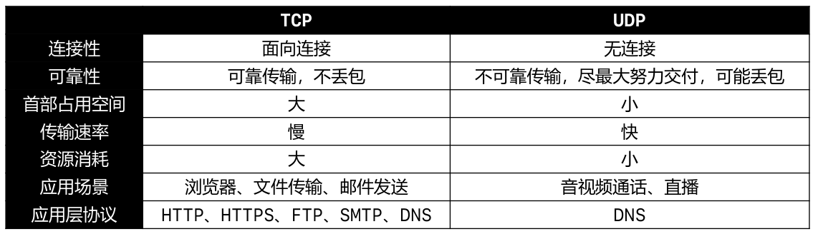

# UDP

UDP是无连接的，减少了建立和释放连接的开销。

UDP尽最大能力交付，不保证可靠交付，因此不需要维护一些复杂的参数，首部只有 8 个字节（TCP 的首部至少 20 个字节）。

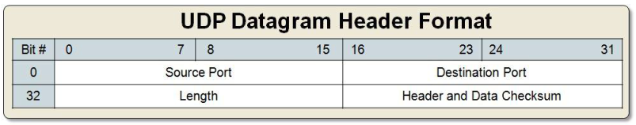

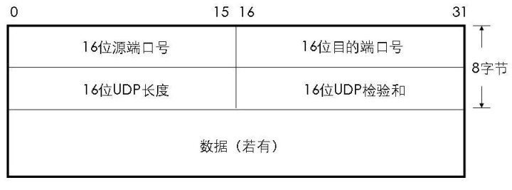

UDP长度（Length）占 16 位 = 首部的长度 + 数据的长度。

检验和的 = 伪首部 + 首部 + 数据。

伪首部仅在计算检验和时起作用，并不会传递给网络层：

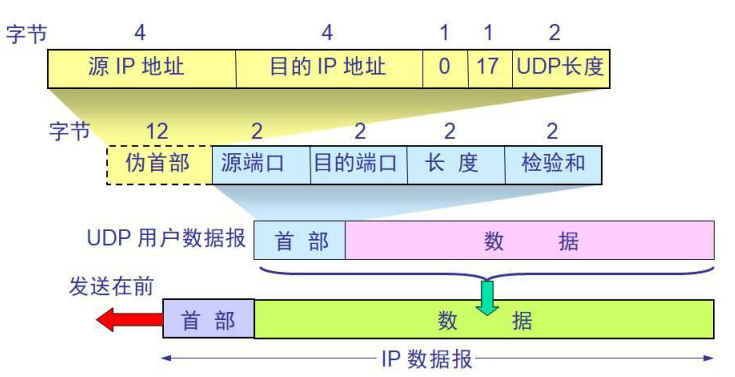

# TCP

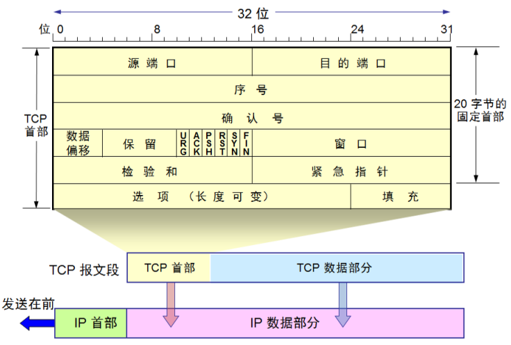

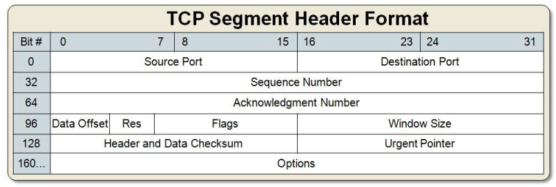

- 数据偏移，占4位，取值范围是 `0b0101 ~ 0b1111`（5~15）
  - 数据偏移 * 4 = 首部长度（Header Length）
  - 首部长度是 20 ~ 60 字节
- 保留，占6位，目前全为0
- 检验和
  - 跟UDP一样，TCP检验和的计算内容：伪首部 + 首部 + 数据，伪首部占用12字节，仅在计算检验和时起作用，并不会传递给网络层
- TCP - 标志位（Flags）URG、ACK、PSH、RST、SYN、FIN
  - URG（Urgent），当 URG = 1 时，紧急指针字段才有效。表明当前报文段中有紧急数据，应优先尽快传送
  - ACK（Acknowledgment），当 ACK = 1 时，确认号字段才有效
  - PSH（Push）
  - RST（Reset），当 RST = 1 时，表明连接中出现严重差错，必须释放连接，然后再重新建立连接
  - SYN（Synchronization），当 SYN = 1、ACK = 0 时，表明这是一个建立连接的请求，若对方同意建立连接，则回复 SYN = 1、ACK = 1
  - FIN（Finish），当 FIN = 1 时，表明数据已经发送完毕，要求释放连接
- 序号（Sequence Number），占4字节，在传输过程的每一个字节都会有一个编号，在建立连接后，序号代表：这一次传给对方的TCP数据部分的第一个字节的编号
- 确认号（Acknowledgment Number），占4字节，在建立连接后，确认号代表：期望对方下一次传过来的TCP数据部分的第一个字节的编号
- 窗口（Window），占2字节，这个字段有流量控制功能，用以告知对方下一次允许发送的数据大小（字节为单位）
  

## 可靠传输

### 自动重传

ARQ（Automatic Repeat–reQuest），自动重传请求：

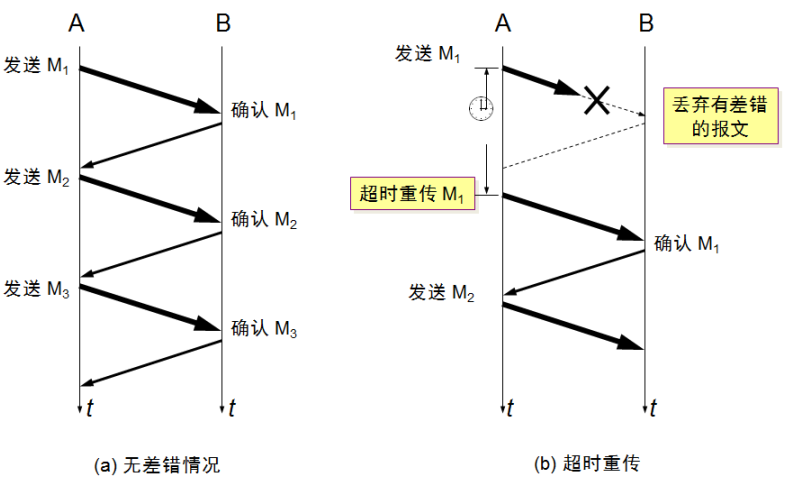

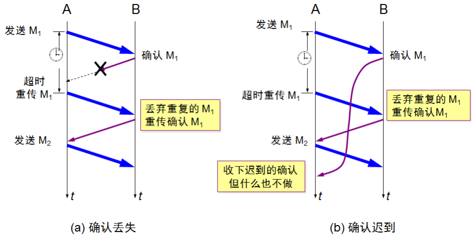

重传的次数取决于系统设置，比如有些系统，重传5次还未成功就会发送 reset报文(RST)  断开 TCP 连接：

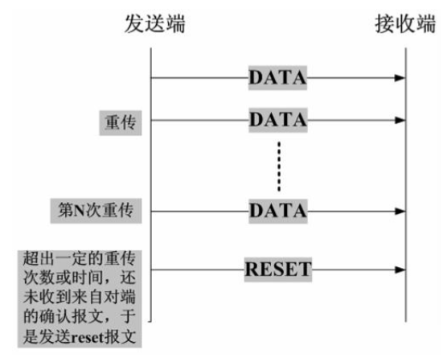

### 自动重传与滑动窗口

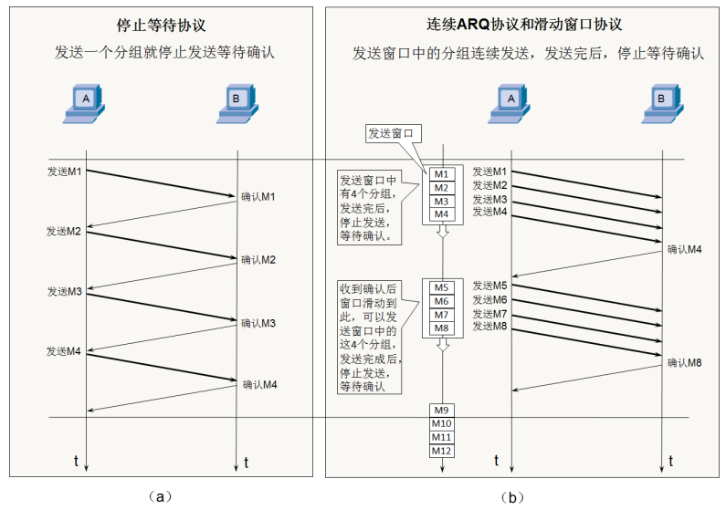

如果接收窗口最多能接收4个包，但发送方只发了2个包，接收方如何确定后面还有没有2个包？等待一定时间后没有第3个包，就会返回确认收到2个包给发送方。

### SACK

在TCP通信过程中，如果发送序列中间某个数据包丢失（比如1、2、3、4、5中3丢失了），TCP会通过重传最后确认的分组后续的分组（最后确认的是2，会重传3、4、5），这样原先已经正确传输的分组也可能重复发送（比如4、5），降低了 TCP 性能。

为改善上述情况，发展出了 SACK（Selective acknowledgment，选择性确认）技术，告诉发送方哪些数据丢失，哪些数据已经提前收到，使 TCP 只重新发送丢失的包（比如3），不用发送后续所有的分组（比如4、5）。

ACK 信息会放在 TCP 首部的选项部分：

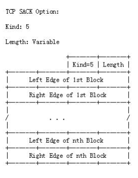

- Kind：占1字节。值为5代表这是 SACK 选项
- Length：占 1 字节。表明 SACK 选项一共占用多少字节
- Left Edge：占4字节，左边界
- Right Edge：占4字节，右边界

一对边界信息需要占用8字节，由于TCP首部的选项部分最多40字节，所以：

- SACK 选项最多携带4组边界信息
- SACK 选项的最大占用字节数 = 4 * 8 + 2 = 34

## 流量控制

流量控制是点对点、端对端，两台设备之间的。

如果接收方的缓存区满了，发送方还在疯狂着发送数据，接收方只能把收到的数据包丢掉，大量的丢包会极大着浪费网络资源，所以要进行流量控制。所谓的流量控制就是让发送方的发送速率不要太快，从而让接收方来得及接收处理。

流量控制的原理：**通过确认报文中窗口字段来控制发送方的发送速率**：

- 发送方的发送窗口大小不能超过接收方给出窗口大小
- 当发送方收到接收窗口的大小为0时，发送方就会停止发送数据

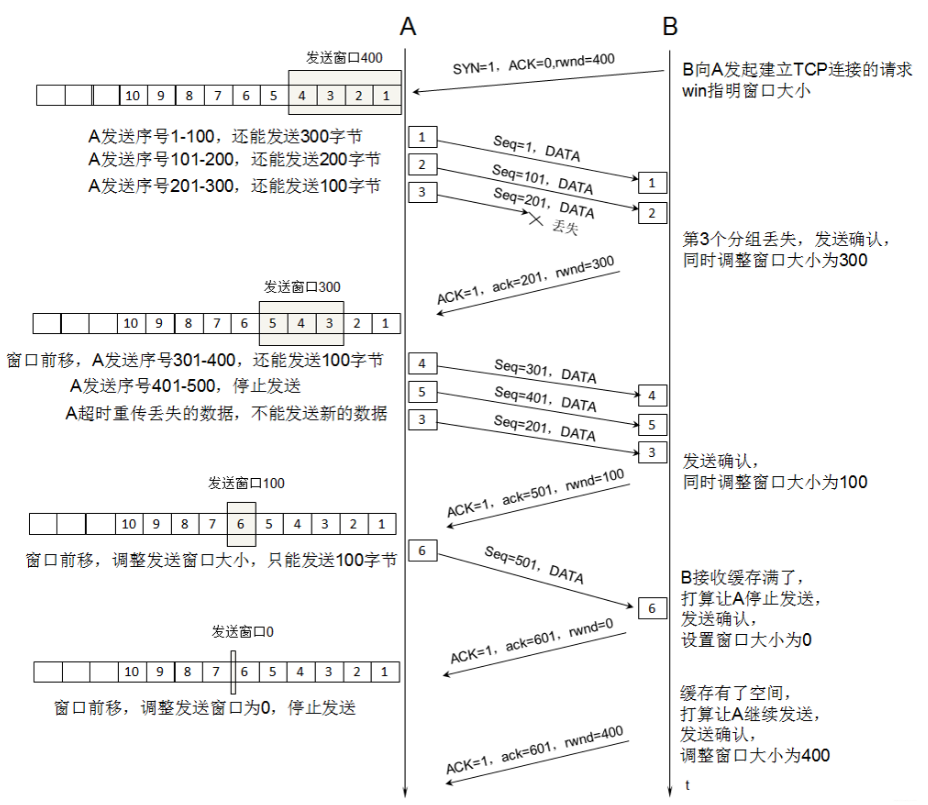

有一种特殊情况：

- 一开始，接收方给发送方发送了 0 窗口的报文段
- 后面，接收方又有了一些存储空间，给发送方发送的非 0 窗口的报文段丢失了
- 发送方的发送窗口一直为0，双方陷入僵局

解决方案：

- 当发送方收到 0 窗口通知时，这时发送方停止发送报文
- 并且同时开启一个定时器，隔一段时间就发个测试报文去询问接收方最新的窗口大小
- 如果接收的窗口大小还是为0，则发送方再次刷新启动定时器

##　拥塞控制

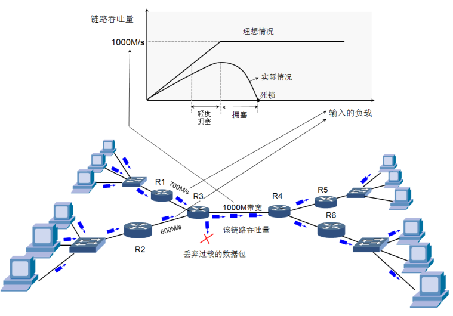

拥塞控制指的是防止过多的数据注入到网络中，避免网络中的路由器或链路过载。

拥塞控制是一个全局性的过程，涉及到所有的主机、路由器，以及与降低网络传输性能有关的所有因素，是大家共同努力的结果。相比而言，流量控制是点对点通信的控制。

几个概念

- MSS（Maximum Segment Size）：每个段最大的数据部分大小（在建立连接时确定），一般是 MTU(1500) - 20 - 20 = 1460
- cwnd（congestion window）：拥塞窗口
- rwnd（receive window）：接收窗口
- swnd（send window）：发送窗口，swnd = min(cwnd, rwnd)

TCP  拥塞控制方法：

- 慢开始（slow start，慢启动）
- 拥塞避免（congestion avoidance）
- 快速重传（fast retransmit）
- 快速恢复（fast recovery）

### 慢开始

cwnd 的初始值比较小，然后随着数据包被接收方确认（收到一个ACK），cwnd就成倍增长（指数级）。

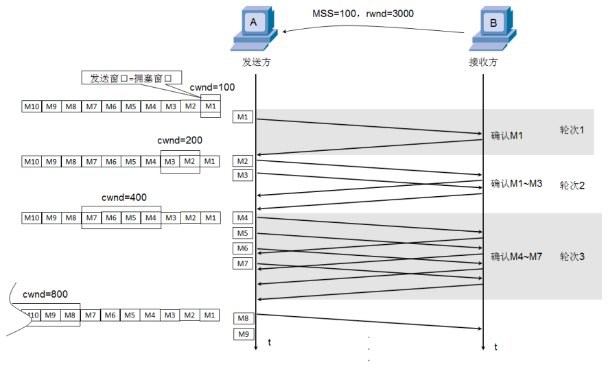

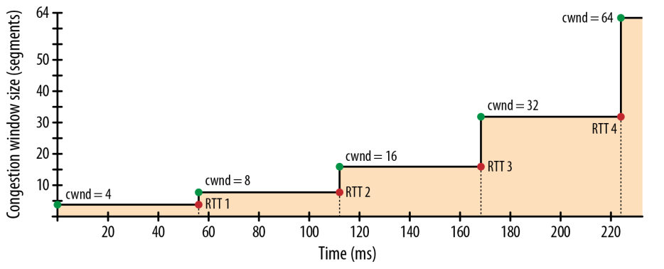

### 拥塞避免

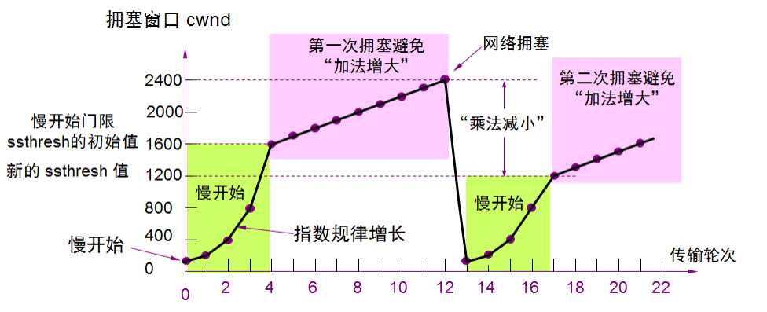

ssthresh (slow start threshold)：慢开始阈值，cwnd 达到阈值后，开始拥塞避免（加法增大）。

拥塞避免（加法增大）：拥塞窗口 cwind 缓慢增大，以防止网络过早出现拥塞。

乘法减小：只要出现网络拥塞，把ssthresh减为拥塞峰值的一半，同时执行慢开始算法（cwnd又恢复到初始值）。

当网络出现频繁拥塞时，ssthresh值就下降的很快。

### 快重传

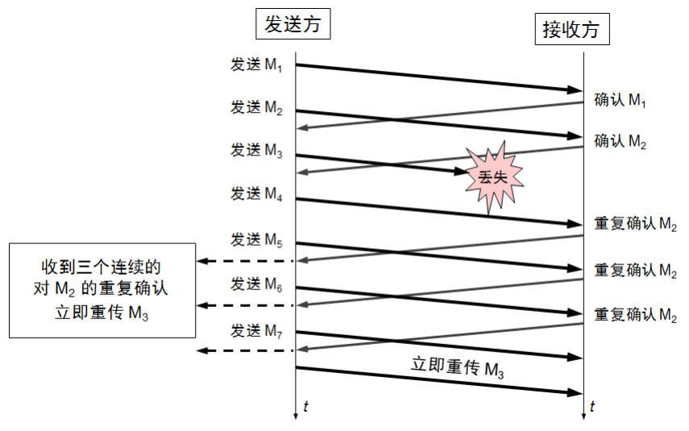

接收方：每收到一个失序的分组后就立即发出重复确认，使发送方计时知道有分组没有到达，而不要等待自己发送数据时才进行确认

发送方：只要连续收到三个重复确认(总共 4 个相同的确认)，就要立即重传对方尚未收到的报文段，而不必继续等待重传计时器到期后再重传

### 快恢复

当发送方连续收到三个重复确认，说明网络出现拥塞，就执行 “乘法减小” 算法，把 ssthresh 减为拥塞峰值的一半，与慢开始不同之处是现在不执行慢开始算法，即 cwnd 现在不恢复到初始值，而是把 cwnd 值设置为新的 ssthresh值（减小后的值），然后开始执行拥塞避免算法（“加法增大”），使拥塞窗口缓慢地线性增大。

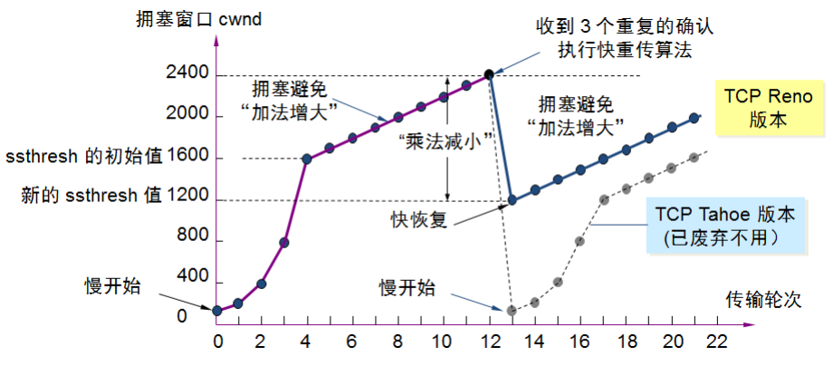

**发送窗口的最大值swnd = min(接收窗口cwnd, 堵塞窗口rwnd)**

- 当 rwnd < cwnd 时，是接收方的接收能力限制发送窗口的最大值
- 当 cwnd < rwnd 时，则是网络的拥塞限制发送窗口的最大值

## 序号、确认号

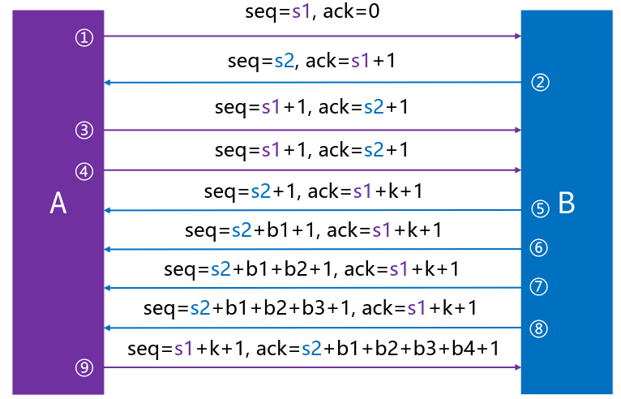

序号、确认号是一一相对的：

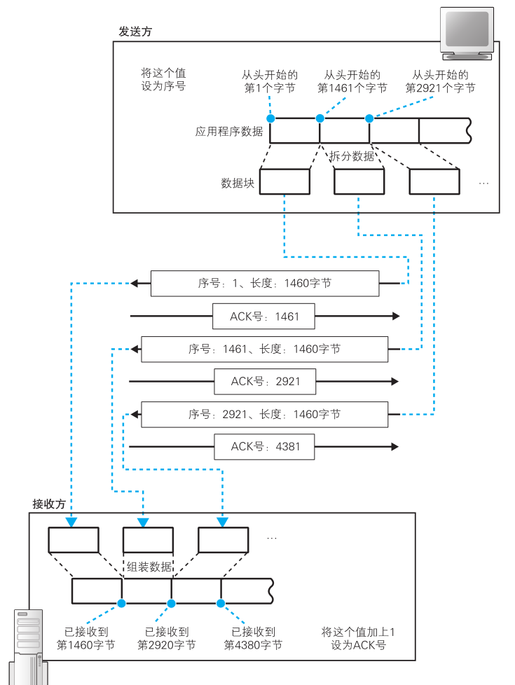

## TCP 建立连接

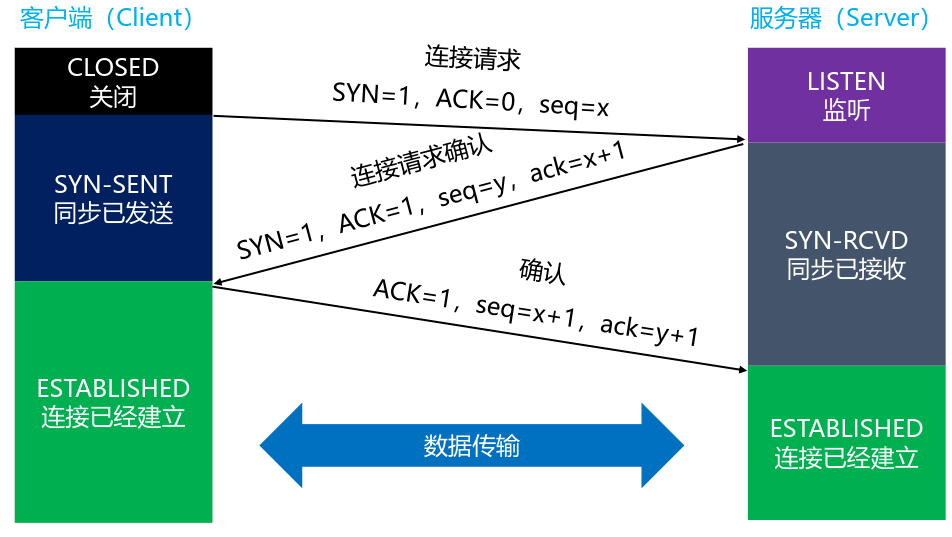

前 2 次握手：

- SYN 都设置为 1
- 数据部分的长度都为 0
- TCP 头部的长度一般是 32 字节，固定头部：20字节，选项部分：12字节
- 双方会交换确认一些信息：比如 MSS、是否支持SACK、Window scale（窗口缩放系数） 等，这些数据都放在了 TCP 头部的选项部分中（12字节）

## TCP 释放连接

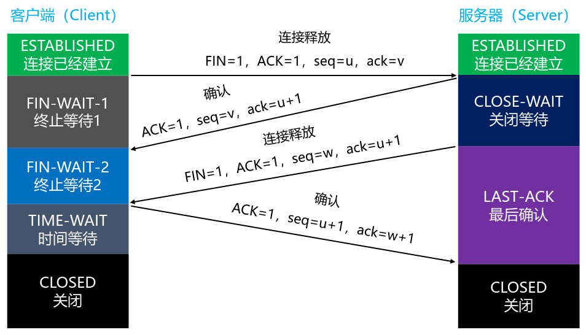

- FIN-WAIT-1：表示想主动关闭连接，向对方发送了 FIN 报文，此时进入到 FIN-WAIT-1 状态
- CLOSE-WAIT：表示在等待关闭，当对方发送FIN给自己，自己会回应一个ACK报文给对方，此时则进入到 CLOSE-WAIT 状态，在此状态下，需要考虑自己是否还有数据要发送给对方，如果没有，发送 FIN 报文给对方
- FIN-WAIT-2：只要对方发送 ACK 确认后，主动方就会处于 FIN-WAIT-2 状态，然后等待对方发送 FIN 报文
- CLOSING：一种比较罕见的例外状态，表示你发送 FIN 报文后，并没有收到对方的 ACK 报文，反而却也收到了对方的 FIN 报文
  如果双方几乎在同时准备关闭连接的话，那么就出现了双方同时发送FIN报文的情况，也即会出现 CLOSING 状态，表示双方都正在关闭连接
- LAST-ACK：被动关闭一方在发送 FIN 报文后，最后等待对方的 ACK 报文，当收到 ACK 报文后，即可进入 CLOSED 状态了
- TIME-WAIT：表示收到了对方的 FIN 报文，并发送出了 ACK 报文，就等 2MSL 后即可进入CLOSED 状态了
- CLOSED：关闭状态

如果 FIN-WAIT-1 状态下，收到了对方同时带 FIN 标志和 ACK 标志的报文时，可以直接进入到 TIME-WAIT 状态，而无须经过 FIN-WAIT-2 状态。

## 实现细节

TCP/IP 协议栈在设计上，允许任何一方先发起断开请求。

client 发送ACK后，需要有个 TIME-WAIT 阶段，等待一段时间后，再真正关闭连接，一般是等待 2 倍的 MSL（Maximum Segment Lifetime，最大分段生存期）
，MSL是TCP报文在 Internet 上的最长生存时间，每个具体的 TCP 实现都必须选择一个确定的 MSL 值，RFC 1122 建议是2分钟，可以防止本次连接中产生的数据包误传到下一次连接中。

如果 client 发送 ACK 后马上释放了，然后又因为网络原因，server 没有收到 client 的 ACK，server 就会重发 FIN，这时可能出现的情况是：

- client 没有任何响应，服务器那边会干等，甚至多次重发FIN，浪费资源
- client 有个新的应用程序刚好分配了同一个端口号，新的应用程序收到 FIN 后马上开始执行断开连接的操作，本来它可能是想跟 server 建立连接的
  

