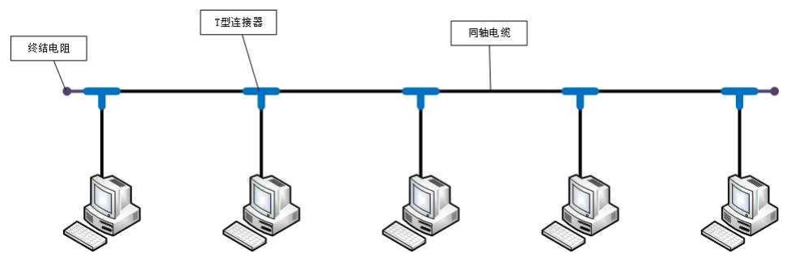
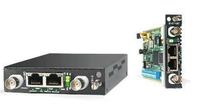

# 计算机之间的连接方式

## 同轴电缆



特点：

- 半双工通信
- 容易产生冲突，效率比较低
- 不安全
- 中间断连，将导致整个网络瘫痪

## 集线器


特点：

- 半双工通信
- 容易产生冲突，效率比较低
- 不安全
- 中间某个设备断连，不会影响到连接集线器的其他设备

## 网桥



特点：

- 能够通过自学习得知每个接口侧的 MAC 地址，从而起到隔绝冲突域的作用

## 交换机


- 相当于接口更多的网桥
- 全双工通信
- 比集线器更安全

若全球所有设备都用交换机连接：

- 他们必然处于同一网段，因此 IP 地址可能会不够用
- 即使使用交换机，第一次发送数据包仍然需要 ARP 广播，耗费大量时间
- 形成广播风暴，只要有一个设备发送 ARP 广播，全球设备都能收到

## 路由器


主机在发数据之前，首先会判断目标主机的IP地址跟它是否在同一个网段：

- 在同一个网段：ARP广播、通过 交换机/集线器传递数据
- 不在同一个网段：通过路由器转发数据

网线直连、同轴电缆、集线器、网桥、交换机：

- 连接的设备必须在同一网段，即连接的设备处在同一广播域

路由器：

- 可以在不同网段之间转发数据，隔绝广播域

# MAC 地址

每个网卡都有一个 6字节(48bit) 的 MAC地址 (Media Access Control Address)，MAC 地址全球唯一，固化在网卡的 ROM 中，由 IEEE802 标准规定。


- 前 3 字节：OUI (Organizationally Unique Identifier)，组织唯一标识符，由 IEEE 的注册管理机构分配给厂商
- 后 3 字节：网络接口标识符，由厂商自行分配

 OUI 查询：可以根据OUI查询出对应的厂商：

- http://standards-oui.ieee.org/oui.txt
- https://mac.bmcx.com/

## MAC 地址的格式

Windows

```
40-55-82-0A-8C-6D
```

Linux、Android、Mac、iOS（类 Unix 操作系统）

```
40:55:82:0A:8C:6D
```

当 48 位全为 1 时，代表广播地址：`FF-FF-FF-FF-FF-FF`。

## 查看 MAC 地址

Windows：

```
ipconfig /all
```

Linux：

```
ifconfig
```

## MAC 地址的获取

当不知道对方主机的MAC地址时，可以通过发送 ARP 广播获取对方的 MAC 地址：

- 获取成功后，会缓存 IP 地址、MAC 地址的映射信息，俗称 ARP 缓存
- 通过 ARP 广播获取的MAC地址，属于动态缓存，存储时间比较短，过期就自动删除

常用命令：

- `arp -a [主机地址]`：查看 ARP 缓存
- `arp -d [主机地址]`：删除 ARP 缓存
- `arp -s 主机地址 MAC地址`：增加一条缓存信息（这是静态缓存，存储时间较久，不同系统的存储时间不同）

# ARP 和 RARP

ARP (Address Resolution Protocol)，地址解析协议，通过 IP地址 获取 MAC地址
RARP (Reverse Address Resolution Protocol)，逆地址解析协议，使用与 ARP 相同的报头结构，作用与 AR P相反，用于将 MAC 地址转换为 IP 地址。

# ICMP

ICMP(Internet Control Message Protocol)，互联网控制消息协议，IPv4 中的ICMP被称作 ICMPv4，IPv6 中的 ICMP 则被称作 ICMPv6，通常用于返回错误信息，
比如 TTL 值过期、目的不可达，ICMP 的错误消息总是包括了源数据并返回给发送者

# IP 地址

IP 地址 (Internet Protocol Address)：互联网上的每一个主机都有一个 IP 地址：

- 最初是 IPv4 版本，32bit（4字节），2019年11月25日，全球的 IP 地址已经用完
- 后面推出了 IPv6 版本，128bit（16字节）

## IP 地址的组成

IP 地址由两部分组成：网络标识（网络ID）、主机标识（主机ID）。

主机所在的网段 = 子网掩码 `&` IP地址：

```
IP地址：192.168.1.10
子网掩码：255.255.255.0

	1100 0000 . 1010 1000 . 0000 0001 . 0000 1010
&	1111 1111 . 1111 1111 . 1111 1111 . 0000 0000
----------------------------------------------------
	1100 0000 . 1010 1000 . 0000 0001 . 0000 0000

网段：192.168.1.0  
```

计算机和其他计算机通信前，会先判断目标主机和自己是否在同一网段：

- 同一网段：不需要由路由器进行转发
- 不同网段：交由路由器进行转发

## IP 地址的分类

判断 IP 地址的类别只要看第一部分即可。

只有 A，B，C 类地址才能分配给主机：

- 主机ID为全0，表示主机所在的网段，如 `192.168.1.0`
- 主机ID为全1，表示主机所在网段的全部主机（广播），如 `192.168.1.255`

### A 类地址


- 默认子网掩码是 `255.0.0.0`
- 网络 ID
  - 必须是 0 开头的
  - 0 不能用，127 作为保留网段，其中 127.0.0.1 是 本地环回地址（Loopback），代表本机地址
  - 可以分配给主机的第1部分的取值范围是：1~126
- 主机 ID
  - 第 2、3、4 部分的取值范围是：`0~255`
  - 每个 A 类网络能容纳的最大主机数是：`256 * 256 * 256 – 2 = 16777214`

### B 类地址


- 默认子网掩码是 `255.255.0.0`
- 网络ID
  - 必须是 10 开头的
  - 第 1 部分的取值范围是：`128~191`
  - 第 2 部分的取值范围是：`0~255`
- 主机ID
  - 第 3、4 部分的取值范围是：`0~255`
  - 每个 B 类网络能容纳的最大主机数是：`256 * 256-2  = 65534`

### C 类地址


- 默认子网掩码是 `255.255.255.0`
- 网络ID
  - 第 1 部分的取值范围是：`192~223`
  - 第 2、3 部分的取值范围是：`0~255`

- 主机ID

  - 第 4 部分的取值范围是：0~255
  - 每个 C 类网络能容纳的最大主机数是：`256-2 = 254`

### D 类地址


- 没有子网掩码，用于多播（组播）地址
- 以 1110 开头，第一部分取值是：224~239

### E 类地址


- 以 1111 开头，保留为今后使用，第一部分取值是：`240~255`

# 子网掩码

CIDR (Classless Inter-Domain Routing)，无类别域间路由，子网掩码的 CIDR 表示方法：

- `192.168.1.100/24`，代表子网掩码有 24 个 1，也就是 `255.255.255.0`
- `123.210.100.200/16`，代表子网掩码有 16 个 1，也就是 `255.255.0.0`

[计算工具](https://www.sojson.com/convert/subnetmask.html)

# 子网划分


