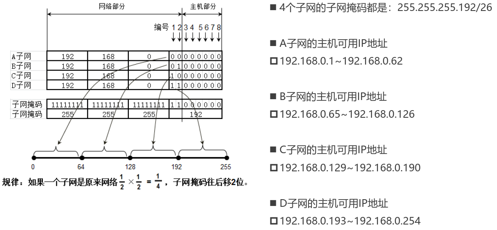

# 计算机之间的连接方式

## 网线直连


注意：

- 需要使用交叉线而不是直通线

​	

## 同轴电缆


特点：

- 半双工通信
- 容易产生冲突，效率比较低
- 不安全
- 中间断连，将导致整个网络瘫痪

## 集线器


例如，`192.168.1.11` 和 `192.168.1.13` 之间通信：


特点：

- 半双工通信
- 容易产生冲突，效率比较低
- 不安全
- 中间某个设备断连，不会影响到连接集线器的其他设备

## 网桥


特点：

- 能够通过自学习得知每个接口侧的 MAC 地址，从而起到隔绝冲突域的作用

## 交换机


- 相当于接口更多的网桥
- 全双工通信
- 比集线器更安全

若全球所有设备都用交换机连接：

- 他们必然处于同一网段，因此 IP 地址可能会不够用
- 即使使用交换机，第一次发送数据包仍然需要 ARP 广播，耗费大量时间
- 形成广播风暴，只要有一个设备发送 ARP 广播，全球设备都能收到

## 路由器


- 可以在不同网段之间转发数据

## 小结

网线直连、同轴电缆、集线器、网桥、交换机：连接的设备必须在同一网段，即连接的设备处在同一广播域

路由器：能够实现跨网段通信

# MAC 地址

每个网卡都有一个 6字节(48bit) 的 MAC地址 (Media Access Control Address)，MAC 地址全球唯一，固化在网卡的 ROM 中，由 IEEE802 标准规定。


- 前 3 字节：OUI (Organizationally Unique Identifier)，组织唯一标识符，由 IEEE 的注册管理机构分配给厂商
- 后 3 字节：网络接口标识符，由厂商自行分配

 OUI 查询：可以根据OUI查询出对应的厂商：

- [OUI 查询](http://standards-oui.ieee.org/oui.txt)
- [OUI 查询](https://mac.bmcx.com/)

## MAC 地址的格式

Windows

```
40-55-82-0A-8C-6D
```

Linux、Android、Mac、iOS（类 Unix 操作系统）

```
40:55:82:0A:8C:6D
```

当 48 位全为 1 时，代表广播地址：`FF-FF-FF-FF-FF-FF`。

## 查看 MAC 地址

Windows：

```
ipconfig /all
```

Linux：

```
ifconfig
```

## MAC 地址的获取

当不知道对方主机的MAC地址时，可以通过发送 ARP 广播获取对方的 MAC 地址：

- 获取成功后，会缓存 IP 地址、MAC 地址的映射信息，俗称 ARP 缓存
- 通过 ARP 广播获取的MAC地址，属于动态缓存，存储时间比较短，过期就自动删除

常用命令：

- `arp -a [主机地址]`：查看 ARP 缓存
- `arp -d [主机地址]`：删除 ARP 缓存
- `arp -s 主机地址 MAC地址`：增加一条缓存信息（这是静态缓存，存储时间较久，不同系统的存储时间不同）

# IP 地址

IP 地址 (Internet Protocol Address)：互联网上的每一个主机都有一个 IP 地址：

- 最初是 IPv4 版本，32bit（4字节），2019年11月25日，全球的 IP 地址已经用完
- 后面推出了 IPv6 版本，128bit（16字节）

## IP 地址的组成

IP 地址由两部分组成：

- 网络标识（网络ID）
- 主机标识（主机ID）

## IP 地址的分类

### A 类地址


- 默认子网掩码是 `255.0.0.0`
- 网络 ID
  - 必须是 0 开头的
  - 0 不能用，127 作为保留网段，其中 127.0.0.1 是 本地环回地址（Loopback），代表本机地址
  - 可以分配给主机的第 1 部分的取值范围是：1~126
- 主机 ID
  - 第 2、3、4 部分的取值范围是：`0~255`
  - 每个 A 类网络能容纳的最大主机数是：`256 * 256 * 256 – 2 = 16777214`

### B 类地址


- 默认子网掩码是 `255.255.0.0`
- 网络ID
  - 必须是 10 开头的
  - 第 1 部分的取值范围是：`128~191`
  - 第 2 部分的取值范围是：`0~255`
- 主机ID
  - 第 3、4 部分的取值范围是：`0~255`
  - 每个 B 类网络能容纳的最大主机数是：`256 * 256-2  = 65534`

### C 类地址


- 默认子网掩码是 `255.255.255.0`
- 网络ID
  - 第 1 部分的取值范围是：`192~223`
  - 第 2、3 部分的取值范围是：`0~255`

- 主机ID

  - 第 4 部分的取值范围是：0~255
  - 每个 C 类网络能容纳的最大主机数是：`256-2 = 254`

### D 类地址


- 没有子网掩码，用于多播（组播）地址
- 以 1110 开头，第一部分取值是：224~239

### E 类地址


- 以 1111 开头，保留为今后使用，第一部分取值是：`240~255`

### 小结

- 判断 IP 地址的类别只要看第一部分即可：
  - 1~126 A 类
  - 127~191 B 类
  - 192~223 C 类
  - 224~239 D 类
  - 240 ~ 255 E 类  

- 只有 A，B，C 类地址才能分配给主机，另外：
  - 主机 ID 为全0，表示主机所在的网段，不能分配给主机，如 `192.168.1.0` 
  - 主机 ID 为全1，表示主机所在网段的全部主机（广播），不能分配给主机，如 `192.168.1.255`

# 子网掩码

## 子网掩码的作用

主机所在的网段 = 子网掩码 `&` IP地址：

```
IP地址：192.168.1.10	  1100 0000 . 1010 1000 . 0000 0001 . 0000 1010
&					   &
子网掩码：255.255.255.0   1111 1111 . 1111 1111 . 1111 1111 . 0000 0000
网段：192.168.1.0         1100 0000 . 1010 1000 . 0000 0001 . 0000 0000
```

计算机和其他计算机通信前，会先判断目标主机和自己是否在同一网段：

- 同一网段：不需要由路由器进行转发
- 不同网段：交由路由器进行转发

另外需要注意的是在判断网段时使用的自身的子网掩码，而不是对端的子网掩码，例如：

下面两台设备可以正常通信吗？


虽然通过各自的 IP 地址和子网掩码计算两台设备的网段都是 `192.168.0.0`。

但是在通信时，是使用对方的 IP 地址和字节的子网掩码进行计算，因为初始情况下并不清楚对端的子网掩码，因而，计算网段的方式：

`192.168.10.10/24` 计算的结果实际上是 `192.168.10.0`，因而对端并不在同一个网段，无法通信

## 子网掩码的 CIDR  表示

CIDR (Classless Inter-Domain Routing)，无类别域间路由，子网掩码的 CIDR 表示方法：

- `192.168.1.100/24`，代表子网掩码有 24 个 1，也就是 `255.255.255.0`
- `123.210.100.200/16`，代表子网掩码有 16 个 1，也就是 `255.255.0.0`

[计算工具](https://www.sojson.com/convert/subnetmask.html)

# 子网划分

子网划分：借用主机位作子网位，划分出多个子网

- 等长子网划分：将一个网段等分成多个子网，每个子网的可用 IP 地址数量一样
- 变长子网划分：每个子网的可用 IP 地址数量可以是不一样的

[子网划分工具](http://www.ab126.com/web/3552.html)

子网划分的步骤：

- 确定子网的子网掩码长度
- 确定子网中第 1 个、最后 1 个主机可用的 IP 地址

## 等长子网划分 

等长划分两个子网：


等分成 4 个子网：



等分成 4 个子网的广播地址：


## 变长子网划分

不等长的子网，子网掩码也不相同。


- C 网段的子网掩码： `255.255.255.128/25`
- B 网段的子网掩码： `255.255.255.192/26`
- A 网段的子网掩码： `255.255.255.224/27`
- D 网段的子网掩码： `255.255.255.252/30`
- E 网段的子网掩码： `255.255.255.252/30`

# 超网

超网就是将多个连续的网段合并成一个更大的网段。

## 合并网段

假设 n 为待合并的网段个数，n 是 2 的 k 次幂，合并条件：如果第一个网段的网络号能够被 m 整除，那么由它开始的连续 n 个网段，能够通过左移 k 位子网掩码进行合并。

例如：

- 第一个网段的网络号以二进制 0 结尾，那么由它开始连续的 2 个网段，可以通过左移 1 位子网掩码进行合并
- 第一个网段的网络号以二进制 00 结尾，那么由它开始连续的 4 个网段，可以通过左移 2 位子网掩码进行合并
- 第一个网段的网络号以二进制 000 结尾，那么由它开始连续的 8 个网段，可以通过左移 3 位子网掩码进行合并


合并 `192.168.0.0/24` 和 `192.128.1.0/24` 为一个网段，只需要将子网掩码向左移动一位：


将 `192.168.0.0/24` 和 `192.128.1.0/24` 合并成网段 `192.168.0.0/23`。


将 `192.168.0.0`， `192.168.1.0`， `192.168.2.0`， `192.168.3.0`  合并成网段 `192.168.0.0/22`

## 判断一个网段是子网还是超网

- 区分网络类型(A类，B类，C类)
  - 默认情况下，A 类子网掩码是 8 位，B 类子网掩码是 16 位，C 类子网掩码是 24 位
- 看相对于默认子网掩码的位数：
  - 子网掩码位数被默认值多：子网
  - 子网掩码位数被默认值少：超网

## 思考

`192.168.0.255/23` 这个 IP 地址可以分配给计算机使用吗？

主机位是 9 位，而不是 8 位，所以这个地址是可用的。


