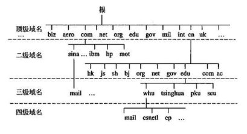
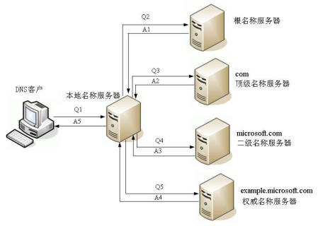
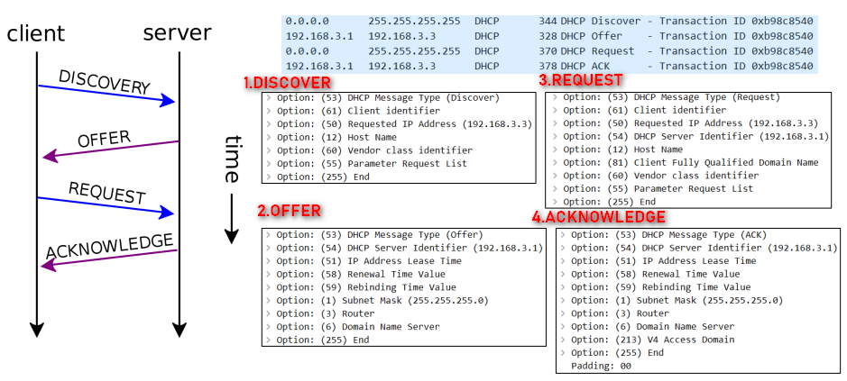

# 应用层的常见协议

- 超文本传输：HTTP、HTTPS
- 文件传输：FTP
- 电子邮件：SMTP、POP3、IMAP
- 动态主机配置：DHCP
- 域名系统：DNS

# 域名

由于IP地址不方便记忆，并且不能表达组织的名称和性质，人们设计出了域名，但实际上，为了能够访问到具体的主机，最终还是得知道目标主机的IP地址。

根据级别不同，域名可以分为：

- 顶级域名（Top-level Domain，简称 TLD）
- 二级域名
- 三级域名
- ...

## 顶级域名的分类

- 通用顶级域名（General Top-level Domain，简称 gTLD）
  - `.com`（公司），`.net`（网络机构），`.org`（组织机构），`.edu`（教育），`.gov`（政府部门），`.int`（国际组织）等
- 国家及地区顶级域名（Country Code Top-level Domain，简称 ccTLD）
  - `.cn`（中国）、`.jp`（日本）、`.uk`（英国）
- 新通用顶级域名（New Generic Top-level Domain，简称 New gTLD）
  - `.vip`、`.xyz`、`.top`、`.club`、`.shop` 等

## 二级域名

二级域名是指顶级域名之下的域名：

- 在通用顶级域名下，它一般指域名注册人的名称，例如 google、baidu、microsoft 等
  例：`google.com`、`baidu.com`、`microsoft.com`
- 在国家及地区顶级域名下，它一般指注册类别的，例如 com、edu、gov、net 等
  例：`china.com.cn`

# DNS

DNS 的全称是：Domain Name System，译为：域名系统。

- 利用 DNS 协议，可以将域名（比如baidu.com） 解析成对应的IP地址
- DNS 可以基于 UDP 协议，也可以基于 TCP 协议，服务器占用 53 端口

- 客户端首先会访问最近的一台 DNS 服务器（也就是客户端自己配置的 DNS 服务器）
- 所有的 DNS 服务器都记录了 DNS 根域名服务器的IP地址
- 上级 DNS 服务器记录了下一级 DNS 服务器的 IP 地址
- 全球一共 13 台 IPv4 的 DNS 根域名服务器、25 台 IPv6 的 DNS 根域名服务器

# IP地址的分配

IP地址按照分配方式，可以分为：静态IP地址、动态IP地址

静态 IP 地址：

- 手动设置
- 适用场景：不怎么挪动的台式机（比如学校机房中的台式机）、服务器等

动态 IP 地址：

-  从 DHCP 服务器自动获取 IP 地址
- 适用场景：移动设备、无线设备等

## DHCP
DHCP（Dynamic Host Configuration Protocol），译为：动态主机配置协议。DHCP 协议基于 UDP协 议，客户端是 68 端口，服务器是 67 端口（双方端口都固定），DHCP 服务器会从IP地址池中，挑选一个 IP 地址 "出租" 给客户端一段时间，时间到期就回收。

DHCP  分配IP的四个阶段（DISCOVER、OFFER、REQUEST、ACKNOWLEDGE）：

- DISCOVER：发现服务器，发广播包（源 IP 是 0.0.0.0，目标 IP 是 255.255.255.255，目标 MAC 是 FF:FF:FF:FF:FF:FF）
- OFFER：提供租约，服务器返回可以租用的 IP 地址，以及租用期限、子网掩码、网关、DNS 等信息
- REQUEST：选择IP地址，客户端选择一个 OFFER，发送广播包进行回应
- ACKNOWLEDGE：确认，被选中的服务器发送 ACK 数据包给客户端

