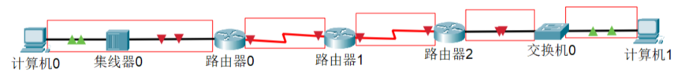
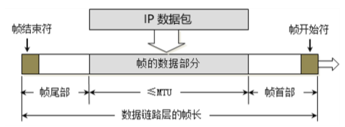
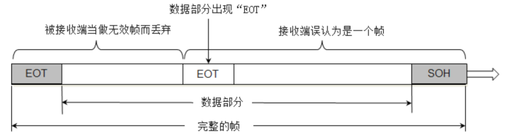
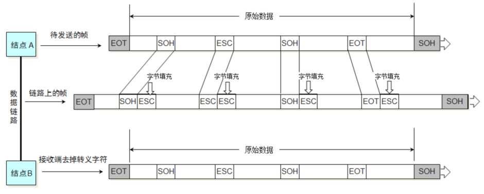
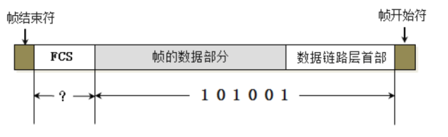
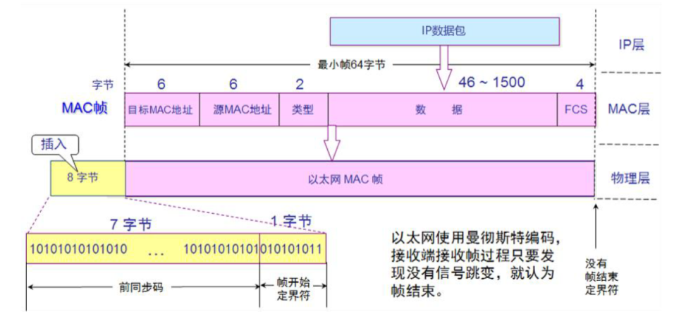
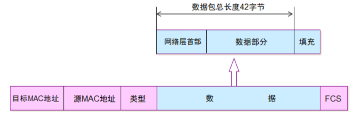
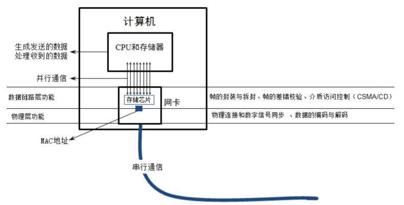
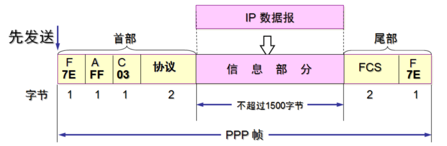
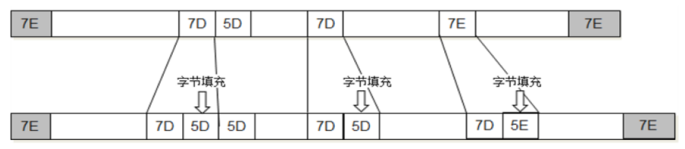

# 数据链路层

链路：从 1 个节点到像您节点的一段物理链路(有线或者无线)，中间没有其他交换节点。

数据链路：在同一条链路上传输数据时，需要有对应的通信协议来控制数据的传输

不同类型的数据链路，所使用的通信协议可能不同：

- 广播信道：CSMA/CD  协议(比如同轴电缆，集线器等组成的网络)
- 点对点信道：PPP 协议(比如2个路由器之间的信道)

数据链路层的 3 个基本问题：

- 封装成帧
- 透明传输
- 差错检验

# 封装成帧

帧的数据部分：网络层传递下来的数据包

最大传输单元 MTU：每种数据链路层协议都规定了能够传送的帧的数据长度上限，对于以太网 MTU 是 1500 个字节#

# 透明传输

- 使用 SOH 作为帧开始符
- 使用 EOT 作为帧结束符

数据部分一旦出现了 SOH 和 EOT，就需要转义，以防止引起歧义：

# 差错检验

FCS 根据数据部分 + 首部计算得到。

# CSMA/CD 协议

CSMA/CD (Carrier Sense Multiple Access with Collision Detectio)

载波侦听多路访问/冲突检测。使用了 CSMA/CD 的网络可以称为是以太网（Ethernet），它传输的是以太网帧。

以太网帧的格式有：Ethernet V2标准、IEEE的802.3标准，使用最多的是：Ethernet V2标准。

为了能够检测正在发送的帧是否产生了冲突，以太网的帧至少要 64 字节。

用交换机组建的网络，已经支持全双工通信，不需要再使用CSMA/CD，但它传输的帧依然是以太网帧，所以，用交换机组建的网络，依然可以叫做以太网。

Ethernet V2帧的格式：

- 首部：目标MAC + 源MAC + 网络类型
- 以太网帧：首部 + 数据 + FCS
- 数据的长度至少：64 - 目标MAC(6)-源MAC(6)-类型(2)-FCS(4) = 46字节

当数据部分的长度小于 46 字节时，数据链路层会在数据的后面加入一些字节填充，接收端会将添加的字节去掉：

## 长度总结

以太网帧的数据长度：46~1500 字节：

- 46 字节 = 64 - 目标MAC(6) - 源MAC(6) - 类型(2) - FCS(4)
- 以太网的 MTU为 1500 个字节

以太网帧的长度：64~1518 字节：

- 为了能够检测正在发送的帧是否产生了冲突，以太网的帧至少要 64 字节
- 1518字节 = 目标MAC(6) + 源MAC(6) + 网络类型(2) + 数据(1500) + FCS(4)

# 网卡

- 网卡接收到一个帧，首先会进行差错校验，如果校验通过则接收，否则丢弃
- Wireshark 抓到的帧没有 FCS，因为它抓到的是差错校验通过的帧，帧尾的 FCS 会被硬件去掉，也就是说 Wireshark 无法抓到差错校验失败的帧

# PPP协议（Point to Point Protocol）

- 帧开始符、帧结束符：0x7E
- Address 字段：图中的值是 0xFF，形同虚设，点到点信道不需要源 MAC、目标 MAC 地址
- Control 字段：图中的值是 0x03，目前没有什么作用
- Protocol 字段：内部用到的协议类型

字节填充：

- 将 0x7E 替换成 0x7D5E
- 将 0x7D 替换成 0x7D5D
