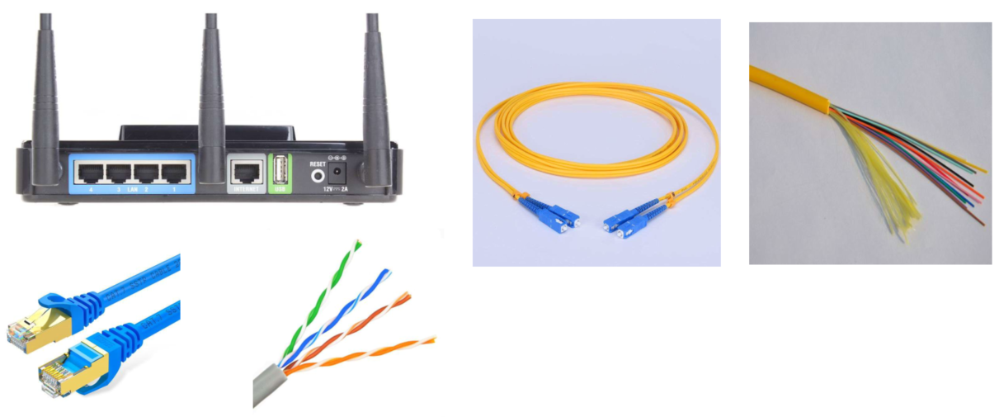
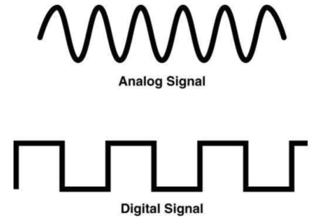
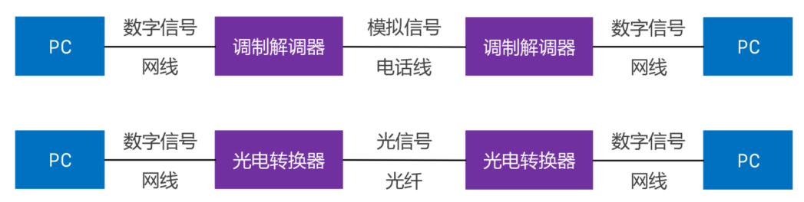

# 物理层

物理层定义了接口标准、线缆标准、传输速率、传输方式等。

# 数字信号、模拟信号

模拟信号：

- 连续的信号，适合长距离传输
- 抗干扰能力差，收到干扰时波形变形很难纠正

数字信号：

- 离散信号，不适合长距离传输
- 扛干扰能力强，收到干扰时波形失真可以修复

# 数据通信模型

## 局域网通信模型

## 广域网通信模型

# 信道

信道：信息传输的通道，一条传输介质上可以有多条信道

## 单工通信

- 信号只能往一个方向传输，任何时候不能改变信号的传输方向
- 比如：无线广播、有线电视

## 半双工通信

- 信号可以双向传输，但是必须交替进行，同一时间只能往一个方向传输
- 比如：对讲机

## 全双工通信

- 信号可以同时双向传输
- 比如：手机

