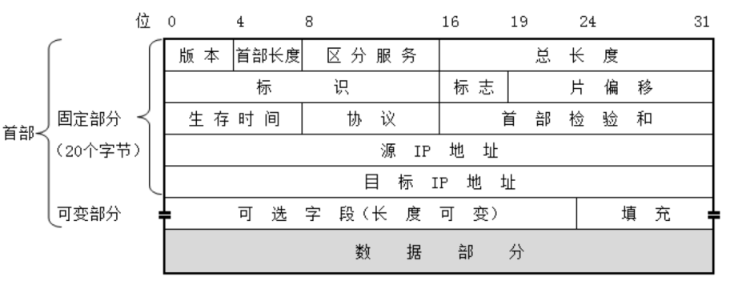
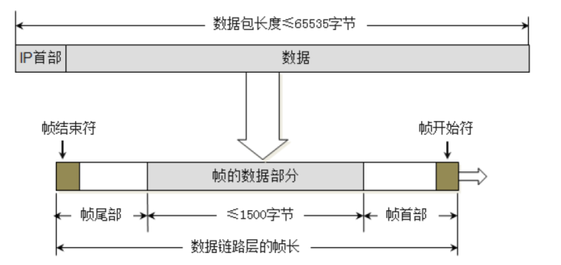
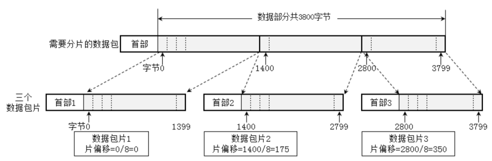
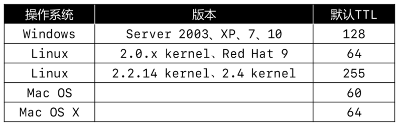
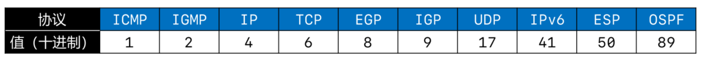

# 网络层

网络层数据包（IP数据包，Packet）由首部、数据两部分组成，数据：很多时候是由传输层传递下来的数据段（Segment）。

- 版本（Version），占4位
  - 0b0100：IPv4
  - 0b0110：IPv6
- 首部长度（Header Length），占4位，二进制乘以4才是最终长度
  - 0b0101：20（最小值）
  - 0b1111：60（最大值）
- 区分服务（Differentiated Services Field），占8位
  - 可以用于提高网络的服务质量（QoS，Quality of Service）
- 总长度（Total Length），占16位
  - 首部 + 数据的长度之和，最大值是 65535

- 由于帧的数据不能超过1500字节，所以过大的IP数据包，需要分片（fragments）传输给数据链路层
- 每一片都有自己的网络层首部（IP首部）

- 标识（Identification），占16位
  - 数据包的ID，当数据包过大进行分片时，同一个数据包的所有片的标识都是一样的
  - 有一个计数器专门管理数据包的ID，每发出一个数据包，ID就加1
- 标志（Flags），占3位
  - 第1位（Reserved Bit）：保留
  - 第2位（Don’t Fragment）：1代表不允许分片，0代表允许分片
  - 第3位（More Fragments）：1代表不是最后一片，0代表是最后一片

- 片偏移（Fragment Offset），占13位
  - 片偏移乘以8：字节偏移（wireshark显示的是字节偏移）
  - 每一片的长度一定是8的整数倍

- 生存时间（Time To Live，TTL），占8位
  - 每个路由器在转发之前会将TTL减1，一旦发现TTL减为0，路由器会返回错误报告
  - 观察使用 `ping` 命令后的TTL，能够推测出对方的操作系统、中间经过了多少个路由器

- 协议（Protocol），占8位
  - 表明所封装的数据是使用了什么协议

- 首部校验和（Header Checksum）
  - 用于检查首部是否有错误
